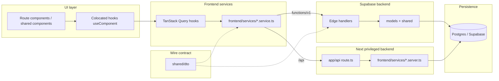
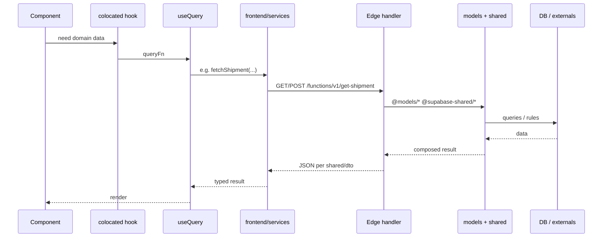
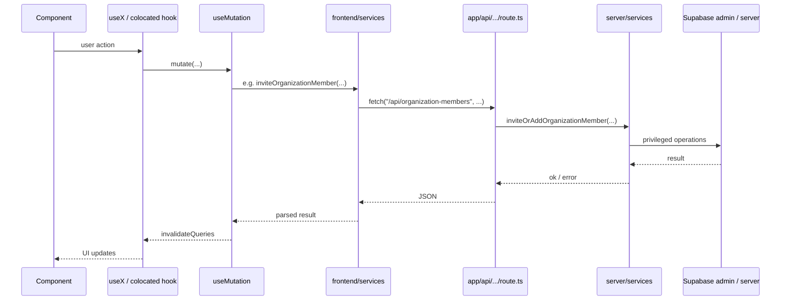

# Frontend ↔ backend communication and code organization

This document describes how the Containerly app moves data from UI to persistence, where each kind of code lives, and how **shared DTOs** define HTTP contracts between **Supabase Edge code** (`supabase/functions/` HTTP layer, `supabase/shared/`, `supabase/models/`) and **frontend services**. It is written for an internal wiki; diagrams use [Mermaid](https://mermaid.js.org/) (supported by many wikis and Git hosts).

---

## 1. Executive summary — Supabase Edge backend ↔ frontend services

**Core pairing:**

```text
Supabase Edge (models + shared + slug services)  ↔  Frontend services  →  Component
```

- **Supabase backend (Edge bundle)** splits into three import surfaces (see `supabase/functions/deno.json`):
  - **`supabase/models/<table>.ts`** — **table-scoped persistence** only (PostgREST-style access helpers per table). Import **`@models/<table>.ts`** from Edge code. No HTTP concerns.
  - **`supabase/shared/`** — **cross-cutting domain and infra** (portal payload builders, tracking orchestration, customer access, providers, `db`, `auth`, `logger`, `utils`). Import **`@supabase-shared/...`**.
  - **`supabase/functions/<slug>/handler.ts`** — **HTTP adapter** for that slug: CORS, auth, parse input, then call **`@supabase-shared/*`** and **`@models/*`** directly. Add a colocated extra module only when a slug has **large slug-only** logic; **do not** add files that only re-export shared symbols.
- **Frontend services** — **`frontend/services/*.service.ts`** are the only place the browser talks to that backend: **`fetch`** to `/functions/v1/<name>` with the user JWT (see `frontend/lib/supabase/edge-functions.ts` for shared transport). **TanStack Query** calls these service modules; components do not call Edge URLs directly.
- **Runtime flow:** **Component → colocated hook → TanStack Query → `frontend/services/` → HTTP → Edge `handler.ts` → `@models/*` / `@supabase-shared/*` → Postgres / externals.**

**Privileged Next (separate):** Operations that need the **service role**, admin client, or secrets that must not run in the browser use **`frontend/services/<domain>.server.ts`** (`import "server-only"`) behind **`frontend/app/api/**/route.ts`**. The browser still enters only through **`frontend/services/`** (`fetch("/api/...")`). That is not PostgREST from the client; it is the same “frontend service as adapter” idea with a Next-hosted backend.

**Not for new data access:** `frontend/services/` calling **PostgREST** via `@/lib/supabase/client` (`.from` / `.rpc`) skips the Edge + models layer. Prefer adding or extending an Edge function whose slug service delegates to **`@models/*`** and **`@supabase-shared/*`**, plus a matching caller in `frontend/services/`. (Exceptions: **Auth** session/login, **Realtime** subscriptions, **Storage** uploads with `File` — keep using the Supabase client only for those transports until you add a dedicated pattern.)

**DTOs (`shared/dto/`):** JSON request/response types shared by **`frontend/services/`** and **`supabase/functions/`** so the two sides stay aligned (plus envelopes like `ServiceResult<T>` in `common.dto.ts`). Next-only `/api` payloads can stay as small local types in `frontend/services/` unless you promote them to a shared contract.

### 1.0 The `supabase/functions/` directory — Edge HTTP API layer

Treat **`supabase/functions/`** as the **Supabase-hosted HTTP API surface** for the app (parallel in spirit to **`frontend/app/api/**/route.ts`** on Next, but deployed and invoked as Edge Functions).

**Folder name = function slug = wire path.** Each immediate child folder is **one deployable Edge Function**. The **directory name must match the Supabase function slug** — that string is what the platform registers and what clients use in the URL:

`POST https://<project-ref>.supabase.co/functions/v1/<slug>`

The Supabase CLI deploys from **`supabase/functions/<slug>/`**; there is no separate “routing table” inside the repo. If you rename the folder, you must update **callers** (for example **`EDGE_FUNCTION_SLUGS`** in `frontend/lib/supabase/edge-function-slugs.ts`), any dashboards, cron jobs, or webhooks that target the old name.

**`index.ts` — entry only, request → handler handoff.** This file should stay minimal: **`Deno.serve`**, **CORS preflight** (`OPTIONS` → `corsHeaders`), then **forward the request** to the colocated handler, for example `return handle(req)`. It should not parse bodies, enforce auth, or contain business logic — that belongs in **`handler.ts`** so every HTTP concern for the slug lives in one obvious place next to the entry.

**`handler.ts` — colocated HTTP adapter for this slug.** The handler is the **per-endpoint wrapper**: HTTP method checks, read/parse JSON or query params, build the Supabase **user** or **service** client from the request, call domain code, map results and errors to **`Response`** (status + JSON). It answers: *“What does this specific HTTP call look like?”* — not *“How does tracking work end-to-end?”*

**Keep handlers thin; push work down the stack.** A handler should **not** grow into a monolith. Prefer:

1. **`@supabase-shared/*.ts`** — orchestration, provider calls, and workflows reused across slugs (or substantial slug-only logic kept out of the handler file when a colocated extra module is justified).
2. **`@models/<table>.ts`** — table-scoped persistence (`.from("<table>")` and related rules in one module per table).

Typical flow: **`handler.ts`** → **`@supabase-shared/...`** (domain service) → **`@models/...`** (and back). Shared modules import models; handlers compose shared + models only as much as needed for HTTP shaping.

**Reference implementation:** `supabase/functions/search-containers/` — **`index.ts`** delegates to **`handle`**; **`handler.ts`** validates method, parses the body, obtains `createUserClient(req)`, calls **`searchContainers`** from **`@supabase-shared/tracking-operations.service.ts`**, and returns **`jsonResponse`** with appropriate status codes. No heavy logic lives in the handler file itself.

```text
Client  →  /functions/v1/<slug>  →  index.ts (Deno.serve, CORS)  →  handler.ts (HTTP)  →  supabase/shared/  →  supabase/models/
```

### 1.1 Repeatable pipeline (Supabase path)

Think in **four layers**, not two files:

| Layer | Location | Role |
|-------|----------|------|
| **Wire slug** | `supabase/functions/<slug>/index.ts` + `handler.ts` | **API layer** (see **§1.0**): **`index.ts`** → **`handler.ts`**; CORS, parse body/query, auth, call **`@supabase-shared/*`** / **`@models/*`**, return JSON. Slugs are **flat** (CLI rule); names are **verb-first** (`get-shipment`, `sync-container`, `create-customer-invite`, …). |
| **Use-case logic** | `supabase/shared/*.ts` (and **`supabase/models/*.ts`**) | Composed by **`handler.ts`**. Optional colocated file under **`functions/<slug>/`** only if logic is **substantial and slug-specific** — not for one-line re-exports. |
| **Table persistence** | `supabase/models/<table>.ts` | RLS-safe reads/writes for one Postgres table; **no** route-specific orchestration. |
| **Shared domain / infra** | `supabase/shared/*.ts` (+ `shared/providers/...`) | Reused across multiple slugs (portal payload, tracking ops, providers, auth helpers). |
| **Contract** | `shared/dto/*.dto.ts` | Request/response shapes both sides import. |
| **Browser adapter** | `frontend/services/<domain>.service.ts` | `fetch` to `/functions/v1/<same-slug-as-folder>`; use **`EDGE_FUNCTION_SLUGS`** in `frontend/lib/supabase/edge-function-slugs.ts` so the path is never a magic string. |

**Why split `models/` vs `shared/` vs `handler.ts`?** Edge folders are **deployment units** (one slug each). Table access stays **stable and reusable** in **`supabase/models/`**. Workflows shared by several slugs live in **`supabase/shared/`**. Each slug’s **HTTP-specific** parsing, status mapping, and auth checks stay in **`handler.ts`** (or a colocated module only when that file would become unwieldy).

**Not strict 1:1 file-to-file:** One shared module (e.g. **`shipment-portal-payload.ts`**) can back **`get-shipment`** and **`preview-customer-shipment`** via different slug services. The **repeatable rule** is: **one Edge slug per HTTP entrypoint**, **one frontend service module per browser-facing domain**, **`shared/dto` per wire contract**, **models per table**, **shared per cross-slug workflow**.

### 1.2 Edge slugs ≠ table domains (granular persistence)

Deploy folder names (`get-shipment`, `create-tracking-request`, …) are **HTTP entrypoints**, not a full domain model. They do **not** map 1:1 to “domains in the database.”

For **separation of concerns at persistence**, treat **each table** (or an inseparable pair) as its own **table domain**. Product words map to tables like this:

| Product language | Primary table(s) |
|------------------|-------------------|
| Messages / thread | **`report_messages`** |
| Documents / files | **`workspace_attachments`** (+ Supabase **Storage** bucket `workspace-files`, not a SQL table) |
| Containers | **`containers`** |
| Shipments | **`shipments`** |
| Tracking / sync jobs | **`tracking_requests`**, **`tracking_events`**, **`external_api_logs`** |
| Alerts | **`alerts`** |
| Customer access | **`customer_invites`**, **`shipment_customer_access`** |
| Shared report links | **`shared_reports`** |
| Activity feed | **`report_activity`** |
| Org / membership | **`organizations`**, **`organization_members`**, **`profiles`** |
| Collaboration | **`shipment_participants`**, **`tracking_request_participants`**, **`tracking_request_watchers`** |

**Convention:** **`supabase/models/<table>.ts`** holds **table-scoped reads/writes** for that Postgres table (exact identifier, e.g. `report_messages.ts`, `workspace_attachments.ts`). **Shared workflows** (`shipment-portal-payload.ts`, `shipment-portal-handlers.ts`, `customer-access.service.ts`, `tracking-operations.service.ts`, `tracking-bol-lookup.ts`, …) **import `@models/*`** and do not call `.from("<table>")` directly except inside the matching model file. Implemented model modules in-repo include: `alerts`, `containers`, `customer_invites`, `external_api_logs`, `organization_members`, `organizations`, `profiles`, `report_activity`, `report_messages`, `shared_reports`, `shipment_customer_access`, `shipment_participants`, `shipments`, `tracking_events`, `tracking_requests`, `workspace_attachments`.

**Orchestration:** A **use-case** (e.g. “shipment portal JSON”, “create tracking request + first sync”) **composes** several models. That orchestrator usually lives in **`supabase/shared/`** (reused across slugs). It **must not** bury all table access in one giant model long-term—**call into `models/`** so each table’s rules stay in one place.

**Frontend mirror:** Prefer the same granularity in **`frontend/services/`** over time: table-scoped helpers or facades that call Edge/Next per resource. PostgREST in `frontend/services/` remains **refactor debt**; new domain writes should go through Edge + **`supabase/models/`** (§7).

**Registry — `public` tables in this repo (persistence domains):**

| Table | Purpose (short) |
|-------|-----------------|
| `profiles` | App profile row per `auth.users`; roles, display, account kind |
| `organizations` | Tenant |
| `organization_members` | User ↔ org membership + org role |
| `shipments` | Commercial shipment / move |
| `containers` | Physical container under a shipment |
| `tracking_requests` | Sync subscription / workflow row per container (or number) |
| `tracking_events` | Carrier/provider event history |
| `alerts` | Alert rows for requests/containers |
| `external_api_logs` | Outbound API audit |
| `shared_reports` | Shareable report metadata for a shipment |
| `report_messages` | Thread messages (shipment and/or container scope) |
| `report_activity` | Activity / audit stream |
| `customer_invites` | Importer invite tokens |
| `shipment_customer_access` | Grant linking customer user to shipment + visibility |
| `workspace_attachments` | File metadata (links to Storage paths; optional `report_message_id`) |
| `shipment_participants` | Org users participating on a shipment |
| `tracking_request_participants` | Users tied to a tracking request |
| `tracking_request_watchers` | Watchers on a tracking request |

**Auth:** `auth.users` is managed by Supabase Auth, not a custom service file; **`profiles`** is the table-aligned module for app-level user fields.

This registry should stay in sync when migrations add or rename tables.

---

## 2. End-to-end dependency flow

Preferred direction of dependencies (no cycles): **`supabase/models/`**, **`supabase/shared/`**, and **Edge `handler.ts`** (Supabase) together with **Next `server/services`** sit next to persistence; **`frontend/services/`** adapts the browser; **UI** sits above.



---

## 3. Request flowcharts — same pattern, Edge vs Next host

### 3.1 Supabase Edge path (default) — `frontend/services` ↔ Edge ↔ `models` + `shared`



**Example:** `ShipmentPortalPayload` (`shared/dto/shipment.dto.ts`) — built from **`@supabase-shared/shipment-portal-handlers.ts`** (and **`shipment-portal-payload.ts`**) plus **`@models/*`**, invoked from **`supabase/functions/get-shipment/handler.ts`**, HTTP slug `get-shipment`, caller `frontend/services/shipment.service.ts` (`EDGE_FUNCTION_SLUGS.shipments.get`).

**Supabase CLI:** Edge deploy still uses **`supabase/functions/<name>/`** (required by the CLI). **`handler.ts` / `index.ts`** stay thin; use-case code lives in **`supabase/shared/`**, table access in **`supabase/models/`**.

### 3.2 Next server service (privileged only)

Same **frontend service → HTTP** shape; handler is **Next** `route.ts` → **`frontend/services/<domain>.server.ts`** when service role, admin client, or secrets require it.



**Example files:** `frontend/app/api/organization-members/route.ts` → `frontend/services/organization.server.ts`; caller in `frontend/services/organization.service.ts`.

---

## 4. Folder and file roles

| Location | Role |
|----------|------|
| `frontend/app/(routes)/...` | App Router pages; route-specific UI colocated under the route |
| `frontend/components/` | Reusable, route-agnostic UI only |
| `frontend/app/api/**/route.ts` | Thin controllers: auth, parse body, call `frontend/services/<domain>.server.ts`, return `NextResponse` |
| `frontend/services/<domain>.server.ts` | **Next** privileged services (`server-only`; service role / admin); only from `app/api` |
| `frontend/services/` | **Frontend services:** browser adapters calling **Supabase** (`/functions/v1/...`) and **Next** (`/api/...`). Prefer **no** PostgREST `.from` / `.rpc` here — add Edge slug + **`models/`** / **`shared/`** instead |
| `supabase/models/<table>.ts` | **Table persistence** — one module per Postgres table; import **`@models/<table>.ts`** from Edge code only |
| `supabase/shared/` | **Cross-slug domain + infra** — portal builders, tracking ops, customer access, providers, `db`, `auth`, `logger`; import **`@supabase-shared/...`** |
| `supabase/functions/<slug>/handler.ts` + `index.ts` | **Deployable Edge HTTP API** (see **§1.0**): slug = folder name = `/functions/v1/<slug>`; **`index.ts`** hands off to **`handler.ts`**; handler stays thin and delegates to **`@supabase-shared/*`** / **`@models/*`** |
| `frontend/hooks/queries/`, `frontend/hooks/mutations/` | TanStack Query; call `frontend/services` only |
| `frontend/lib/supabase/` | Supabase client factories (browser, server, admin) |
| `frontend/types/` | App-specific and DB-aligned types (e.g. generated or hand-maintained table shapes) |
| `shared/dto/` | HTTP contract between **frontend services** and **Supabase Edge** (same types as `index.ts` handlers + `frontend/services/`) |

### 4.1 Component folder convention (route or shared)

Colocated pure helpers live in a **single** `utils.ts` next to the component — not a `utils/` directory.

```
ComponentName/
  index.tsx              # presentation
  hooks/
    useComponentName.ts  # optional orchestration; uses Query hooks
  utils.ts               # optional — pure helpers only (one file)
  types.ts               # optional
```

Shared across routes: `frontend/utils/` (or domain-specific files under `frontend/utils/`).

---

## 5. DTO strategy (`shared/dto`)

### 5.1 Purpose

- **Single source of truth** for JSON bodies and query semantics between:
  - **Frontend services:** `frontend/services/*.ts`
  - **Supabase Edge:** `supabase/models/`, `supabase/shared/`, and `supabase/functions/<slug>/` (Deno)
- Avoid duplicating large portal or tracking shapes in two places.
- `shared/dto/index.ts` re-exports modules for convenient barrel imports when desired.

### 5.2 What belongs in `shared/dto`

- Request/response types for **Edge Function** APIs (`CreateTrackingRequestBody`, `ShipmentPortalPayload`, `AcceptCustomerInviteResponse`, etc.).
- Small **cross-cutting** helpers such as `ServiceResult<T>` / `ErrorResponse` in `shared/dto/common.dto.ts` for consistent success/error envelopes.

### 5.3 What usually does *not* belong there

- React props or view models.
- Types that only describe PostgREST rows — prefer `frontend/types/database.ts` (or generated types) unless an Edge function intentionally mirrors a table 1:1 in its public API.
- Next.js Route Handler–only payloads, unless you later promote the same contract to Edge or another consumer.

### 5.4 Example (trimmed)

**DTO** (`shared/dto/shipment.dto.ts`):

```ts
export type ShipmentPortalPayload = {
  report: ReportMeta;
  organization: ReportOrganization;
  summary: ReportSummary;
  // ...
};
```

**Frontend service** consumes it after `JSON.parse`:

```ts
import type { ShipmentPortalPayload } from "@shared/dto/shipment.dto";

// parse response, then:
return { ok: true, data: body as ShipmentPortalPayload };
```

**Slug services and shared modules** import the same DTO types when building the response so the compiler checks field names and nesting.

---

## 6. Mental model: frontend services vs Supabase Edge vs Next services

| | **Frontend services** `frontend/services/*.service.ts` | **Supabase Edge** `models` + `shared` + **`functions/<slug>/handler.ts`** | **Next** `frontend/services/*.server.ts` |
|--|------------------|------------------------|----------------------|
| **Role** | Browser adapter; calls HTTP only | Persistence + workflows behind Edge | Privileged logic behind `/api` |
| **Runs in** | Browser | Deno (Edge) | Node |
| **Called from** | TanStack Query, hooks | Edge `index.ts` → `handler.ts` → `@supabase-shared` / `@models` | `app/api/**/route.ts` |
| **Calls** | `fetch` → `functions/v1` or `/api` | `@models/*`, `@supabase-shared/*`, Supabase clients, externals | Admin / service role as needed |
| **Contract** | `shared/dto` + Edge paths | Implements DTO shapes | Local JSON or promoted DTOs |

`shared/dto/` keeps **frontend services** and **Supabase (Edge) handlers** aligned on the wire format.

---

## 7. Copy-paste checklist for new features

1. **UI** in route folder or `frontend/components/`; no `fetch`, no Supabase in `index.tsx`.
2. **Colocated hook** if orchestration or local UI state is non-trivial.
3. **TanStack Query** hook in `frontend/hooks/queries/` or `mutations/`.
4. **Supabase Edge first:** add or extend **`supabase/models/<table>.ts`** for new table access, **`supabase/shared/`** for cross-slug logic, **`shared/dto`** for the HTTP contract, and a thin **`supabase/functions/<slug>/handler.ts`** (and **`index.ts`**) that calls **`@models/*`** and **`@supabase-shared/*`**.
5. **Frontend service:** add a caller in **`frontend/services/<area>.service.ts`** using **`EDGE_FUNCTION_SLUGS`** from **`frontend/lib/supabase/edge-function-slugs.ts`** with **`edgeFunctionFetch`** / the same auth header pattern. Query hooks call **only** `frontend/services/`.
6. **Privileged:** implement **`frontend/services/<domain>.server.ts`** + **`app/api/.../route.ts`**; call from **`frontend/services/*.service.ts`** with `fetch("/api/...")`.
7. **Avoid** new PostgREST (`.from` / `.rpc`) inside `frontend/services/` for domain data — route through Edge + **`models/`** / **`shared/`** instead.

---

## 8. Related in-repo references

- Architecture rules for day-to-day edits: `.cursorrules`
- Example imports: `grep -r "@models/" supabase/functions`, `grep -r "@supabase-shared/" supabase/functions`, and `grep -r "@shared/dto" supabase/functions frontend`

---

*Last aligned with repository layout as of internal documentation authoring; update this page when changing how Edge vs Next privileged boundaries work.*
