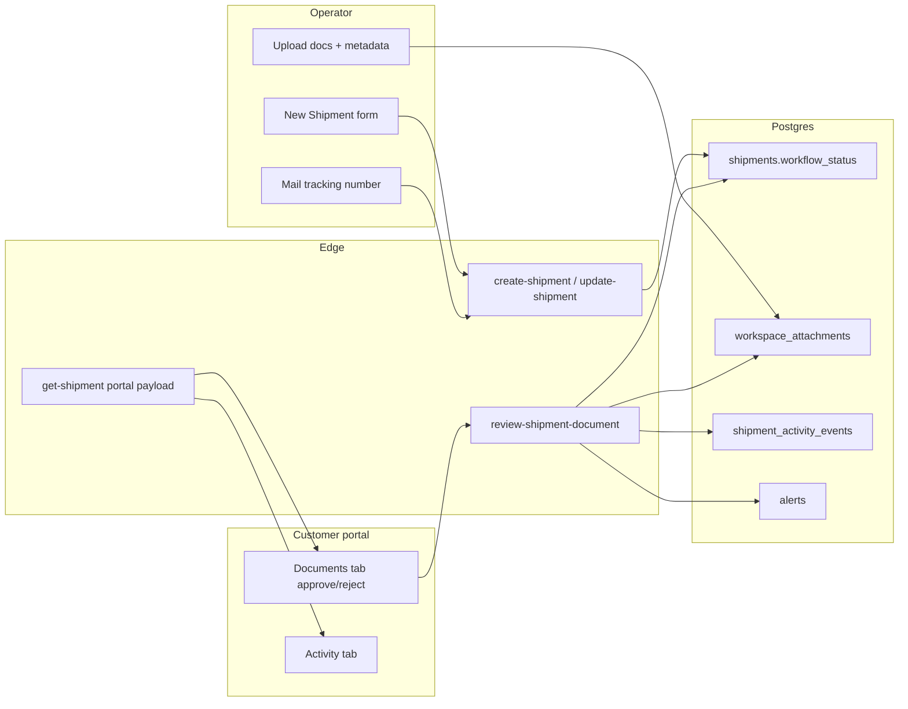
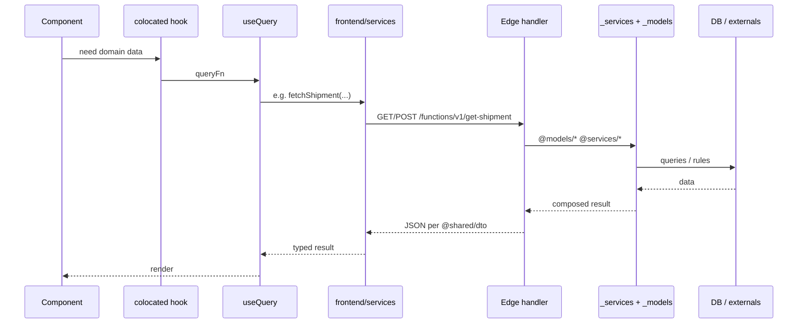
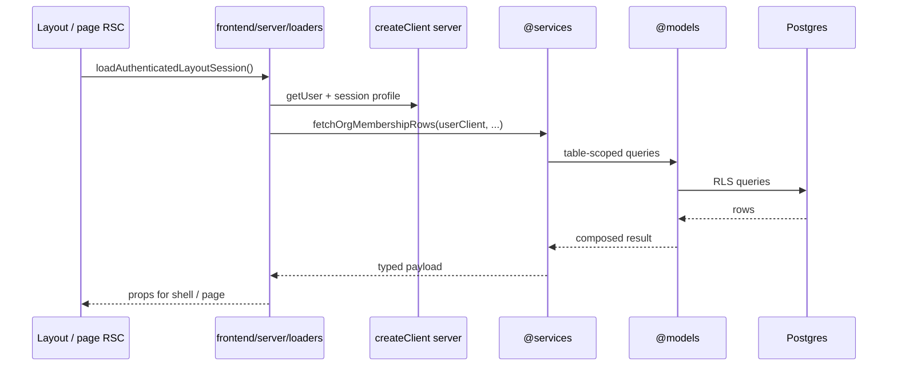

# Frontend ↔ backend communication and code organization

This document describes how the Containerly app moves data from UI to persistence, where each kind of code lives, and how **`@shared/dto`** defines contracts between **browser services**, **Edge handlers**, and **SSR loaders** against a single **`_services` + `_models`** backend.

**Agent constraints:** [`.cursorrules`](../.cursorrules) holds invariant rules for day-to-day edits. **This doc** holds examples, file traces, checklists, and domain-specific detail.

**Product note:** Primary user journeys are **export documentation**, **customer portal**, and **manual commercial data entry**. Live carrier container tracking (JSONCargo-style API, BOL bulk import) is an **optional premium path** enabled after document approval — not the default onboarding flow.

---

## 1. Executive summary — Supabase Edge backend ↔ frontend services

**Core pairing:**

```text
Supabase Edge (models + shared + slug services)  ↔  Frontend services  →  Component
```

- **Backend surfaces:** `@models/<table>.ts` (table persistence), `@services/...` (orchestration + infra), `<slug>/handler.ts` (HTTP adapter). See `.cursorrules` for layer invariants.
- **Browser path:** TanStack Query → `frontend/services/` → `/functions/v1/<slug>` → handler → `@services` / `@models` → Postgres.
- **SSR path:** `frontend/server/loaders/` → `@services` / `@models` (no HTTP). **Auth only:** `/api/auth/session`.
- **DTOs:** `supabase/functions/_wire/dto/` (`@shared/dto/`) — wire contracts for browser services, Edge, and SSR loaders.

### 1.0 The `supabase/functions/` directory — Edge HTTP API layer

Each **`supabase/functions/<slug>/`** folder is one deployable Edge Function; folder name = slug = `POST …/functions/v1/<slug>`. Update **`EDGE_FUNCTION_SLUGS`**, cron, and webhooks when renaming.

**Reference implementation:** `supabase/functions/search-containers/` — thin **`index.ts`** → **`handler.ts`** → **`searchContainers`** in **`@services/tracking/tracking.service.ts`**.

```text
Client  →  /functions/v1/<slug>  →  index.ts (Deno.serve, CORS)  →  handler.ts (HTTP)  →  _services/ (@services)  →  _models/ (@models)
```

### 1.1 Repeatable pipeline (Supabase path)

Think in **four layers**, not two files:

| Layer | Location | Role |
|-------|----------|------|
| **Wire slug** | `supabase/functions/<slug>/index.ts` + `handler.ts` | **API layer** (see **§1.0**): **`index.ts`** → **`handler.ts`**; CORS, parse body/query, auth, call **`@services/*`** / **`@models/*`**, return JSON. Slugs are **flat** (CLI rule); names are **verb-first** (`get-shipment`, `sync-container`, `create-customer-invite`, …). |
| **Use-case logic** | `supabase/functions/_services/*.ts` (and **`_models/*.ts`**) | Composed by **`handler.ts`** and **SSR loaders**. Optional colocated file under **`functions/<slug>/`** only if logic is **substantial and slug-specific** — not for one-line re-exports. |
| **Table persistence** | `supabase/functions/_models/<table>.ts` | RLS-safe reads/writes for one Postgres table; **no** route-specific orchestration. |
| **Shared domain / infra** | `supabase/functions/_services/*.ts` (+ `providers/...`) | Reused across multiple slugs (portal payload, tracking ops, providers, auth helpers). |
| **Contract** | `supabase/functions/_wire/dto/*.dto.ts` | Request/response shapes all runtimes import via `@shared/dto/`. |
| **Browser adapter** | `frontend/services/<domain>.service.ts` | `fetch` to `/functions/v1/<same-slug-as-folder>`; use **`EDGE_FUNCTION_SLUGS`** in `frontend/lib/supabase/edge-function-slugs.ts` so the path is never a magic string. |

Edge folders are deployment units; table access lives in **`_models/`**, cross-slug workflows in **`_services/`**, HTTP shaping in **`handler.ts`**.

#### `_services/` domain directory layout

Edge orchestration lives under **`supabase/functions/_services/{domain}/`**. Primary use-case module per domain: **`{domain}.service.ts`** (no `-operations` suffix). Related helpers colocate in subfolders:

```text
_services/
  auth.ts, db.ts, logger.ts, utils.ts, …          # infra at root
  shipment/shipment.service.ts, list.service.ts
  shipment/portal/payload.ts, handlers.ts, messages.service.ts
  shipment/activity/edit.utils.ts, edit.service.ts, notifications.service.ts
  tracking/tracking.service.ts, dashboard.service.ts, sync.ts, bol-lookup.ts
  organization/organization.service.ts, onboarding.service.ts, tenant-invite.service.ts
  workspace/workspace.service.ts
  customer/customer-access.service.ts
  notification/workflow.service.ts, in-app-alerts.ts
  …
```

Import via **`@services/shipment/shipment.service.ts`**, **`@services/tracking/tracking.service.ts`**, etc. (see `supabase/functions/deno.json`).

**Not strict 1:1 file-to-file:** One service module (e.g. **`@services/shipment/portal/payload.ts`**) can back **`get-shipment`** and **`preview-customer-shipment`** via different slug handlers. The **repeatable rule** is: **one Edge slug per HTTP entrypoint**, **one frontend service module per browser-facing domain**, **`shared/dto` per wire contract**, **models per table**, **services per cross-slug workflow**.

### 1.1.1 API naming parity (Edge slug ↔ stack)

For **thin 1:1 HTTP adapters**, names must trace predictably from slug → service → mutation hook. **`EDGE_FUNCTION_SLUGS`** is the source of truth for slug strings.

| Layer | Pattern | `create-shipment` example |
|-------|---------|---------------------------|
| Edge folder / URL | `verb-noun` kebab-case | `create-shipment/` |
| `frontend/services/*.service.ts` | slug → camelCase `verbNoun` | `createShipment` |
| `frontend/hooks/mutations/use<Domain>.ts` | `useVerbNounMutation` | `useCreateShipmentMutation` |
| `supabase/functions/_services/` (handler-called) | same `verbNoun` | `createShipment` |
| `handler.ts` | imports and calls matching export | `createShipment(...)` |

**Good:** `create-organization` → `createOrganization` → `useCreateOrganizationMutation`.

**Forbidden on 1:1 adapters:** extra qualifiers not in the slug (`Commercial`, `Platform`, `Admin`, `Browser`, `Query`, …). DTOs (`CreateShipmentBody`, …) describe payload shape — they are **not** renamed to match slugs.

**Bulk / client orchestration** (no dedicated slug): `bulk` + target verbNoun — e.g. `bulkCreateShipments` loops `create-shipment`.

**Legacy `*Browser` / `*Query` suffixes:** migrate to slug-aligned names when touching a module; do not add new ones.

### 1.2 Edge slugs ≠ table domains (granular persistence)

Deploy folder names (`get-shipment`, `create-tracking-request`, …) are **HTTP entrypoints**, not a full domain model. They do **not** map 1:1 to “domains in the database.”

For **separation of concerns at persistence**, treat **each table** (or an inseparable pair) as its own **table domain**. Product words map to tables like this:

| Product language | Primary table(s) |
|------------------|-------------------|
| Messages / thread | **`report_messages`** |
| Documents / files | **`workspace_attachments`** (+ Storage bucket `workspace-files`; optional `document_type`, `document_group`, `approval_status`) |
| Containers | **`containers`** |
| Shipments | **`shipments`**, **`shipment_lines`** (order/booking lines) |
| Tracking / sync jobs | **`tracking_requests`**, **`tracking_events`**, **`external_api_logs`** |
| Alerts | **`alerts`** (optional `shipment_id` for doc-only shipments) |
| Customer access | **`customer_invites`** (`delivery_mode`: email vs allowlist), **`shipment_customer_access`** |
| Shared report links | **`shared_reports`** |
| Activity feed | **`report_activity`**, **`shipment_activity_events`** (structured portal timeline) |
| Org / membership | **`organizations`**, **`organization_members`**, **`profiles`** |
| Collaboration | **`shipment_participants`**, **`shipment_notification_subscriptions`**, **`shipment_message_thread_reads`** |

**Convention:** **`supabase/functions/_models/<table>.ts`** holds **table-scoped reads/writes** for that Postgres table (exact identifier, e.g. `report_messages.ts`, `workspace_attachments.ts`, `shipment_lines.ts`, `shipment_activity_events.ts`). **Shared workflows** (`shipment/portal/payload.ts`, `shipment/portal/handlers.ts`, `shipment/shipment.service.ts`, `shipment/document.service.ts`, `customer/customer-access.service.ts`, `notification/workflow.service.ts`, `email/email.service.ts`, `tracking/tracking.service.ts`, `workspace/workspace.service.ts`, `tracking/bol-lookup.ts`, …) **import `@models/*`** and do not call `.from("<table>")` directly except inside the matching model file. Implemented model modules in-repo include: `alerts`, `containers`, `customer_invites`, `external_api_logs`, `organization_members`, `organizations`, `profiles`, `report_activity`, `report_messages`, `shared_reports`, `shipment_activity_events`, `shipment_customer_access`, `shipment_lines`, `shipment_participants`, `shipments`, `tracking_events`, `tracking_requests`, `workspace_attachments`.

**Orchestration:** A **use-case** (e.g. “shipment portal JSON”, “create tracking request + first sync”) **composes** several models. That orchestrator usually lives in **`supabase/functions/_services/`** (reused across slugs and SSR loaders). It **must not** bury all table access in one giant model long-term—**call into `_models/`** so each table’s rules stay in one place.

**Frontend mirror:** **`frontend/services/`** exposes one browser adapter per product domain, each calling Edge slugs. PostgREST in `frontend/services/` is **not allowed** for domain data; new writes go through Edge + **`_models/`** / **`_services/`** (§7).

**Registry — `public` tables in this repo (persistence domains):**

| Table | Purpose (short) |
|-------|-----------------|
| `profiles` | App profile row per `auth.users`; roles, display, account kind |
| `organizations` | Tenant |
| `organization_members` | User ↔ org membership + org role |
| `shipments` | Commercial shipment header; `workflow_status` for documentation lifecycle |
| `shipment_lines` | Order/booking line items (multi-line, multi-container) |
| `containers` | Physical container under a shipment |
| `tracking_requests` | Sync subscription / workflow row per container (or number) |
| `tracking_events` | Carrier/provider event history |
| `alerts` | In-app notifications; `container_id` and/or `shipment_id` |
| `external_api_logs` | Outbound API audit |
| `shared_reports` | Shareable report metadata for a shipment |
| `report_messages` | Thread messages (shipment and/or container scope) |
| `report_activity` | Legacy activity / audit stream |
| `shipment_activity_events` | Structured portal activity (docs approved, mail sent, thread messages, etc.); message rows link via **`report_message_id`** FK |
| `customer_invites` | Importer invite tokens; `delivery_mode` for email vs allowlist |
| `shipment_customer_access` | Grant linking customer user to shipment + visibility |
| `shipment_customer_access_requests` | Customer access request workflow (approve/deny) |
| `workspace_attachments` | File metadata; document workflow columns when customer-facing |
| `shipment_participants` | Org users participating on a shipment |
| `shipment_notification_subscriptions` | Per-user shipment notification preferences |
| `shipment_message_thread_reads` | Per-user read cursors for shipment threads |
| `platform_tenant_invites` | Superadmin-issued invites for new operator tenants |
| `user_feedback` | In-app feedback submissions |

**Auth:** `auth.users` is managed by Supabase Auth, not a custom service file; **`profiles`** is the table-aligned module for app-level user fields.

This registry should stay in sync when migrations add or rename tables.

### 1.3 Logistics documentation workflow (commercial shipments)

Shipments can exist **without container tracking**. Operators create a commercial header + **`shipment_lines`** via **`create-shipment`**; customers review documents and activity in the portal.



| Step | Edge slug | `_services` module | DTO |
|------|-----------|---------------|-----|
| Create / update commercial shipment | `create-shipment`, `update-shipment` | `shipment/shipment.service.ts` | `@shared/dto/logistics.dto.ts`, `shipment.dto.ts` |
| Customer document approve/reject | `review-shipment-document` | `shipment/document.service.ts` | `logistics.dto.ts` |
| Portal read (docs, activity, commercial) | `get-shipment` | `shipment/portal/payload.ts`, `shipment/portal/handlers.ts` | `shipment.dto.ts` |
| Notion-style allowlist claim | `claim-shipment-access` | `customer/customer-access.service.ts` | `customer-access.dto.ts` |
| Transactional email + in-app alerts | (called from `_services` services) | `email/email.service.ts`, `notification/workflow.service.ts` | — |
| List / acknowledge alerts | `list-alerts`, `acknowledge-alert`, `acknowledge-all-alerts` | `alert/alert.service.ts` | `alert.dto.ts` |
| Operator shipment list | `list-operator-shipments` | `shipment/list.service.ts` | — |
| Tracking dashboard snapshot | `get-tracking-dashboard` | `tracking/dashboard.service.ts` | — |

**`workflow_status` on `shipments`:** `draft` → `awaiting_review` → `revisions_needed` | `approved` → `mailed` → `in_transit` (when carrier tracking is linked).

**Frontend entry points:** header **New Shipment** opens **`NewShipmentModalHost`** (Jotai `newShipmentModalOpenAtom`) → **`NewShipmentForm`** → **`useCreateShipmentMutation`** → **`createShipment`** → Edge **`create-shipment`**; operator workspace `/shipments/[shipmentId]` edits and deletes use the same mutation stack (`useUpdateShipmentMutation`, `useDeleteShipmentMutation` + colocated hooks + `shipment-workspace-row` cache helpers in `useShipment.ts`); customer portal `/requests/[reportId]` (`PublicContainerReport`). Optional carrier sync is a separate **`create-tracking-request`** path after document approval.

---

## 2. End-to-end dependency flow

Preferred dependency direction (no cycles): UI → Query / atoms → `frontend/services` or SSR loaders → Edge handler (browser only) → `@services` → `@models` → DB.

```mermaid
flowchart LR
  subgraph ui [UI layer]
    C[Route components / shared components]
    H[Colocated hooks useComponent]
    RSC[RSC layouts / pages]
  end
  subgraph browser [Browser path]
    Atoms[frontend/atoms Jotai]
    Q[TanStack Query hooks]
    FSvc[frontend/services/*.service.ts]
  end
  subgraph shell [Client UI shell]
    Hosts[frontend/hosts *Host]
  end
  subgraph ssr [SSR path]
    L[frontend/server/loaders/*.ts]
  end
  subgraph backend [Single backend code]
    Edge[Edge handler.ts]
    Services[_services @services]
    Models[_models @models]
  end
  subgraph authOnly [Next auth only]
    AuthRoute[/api/auth/session]
  end
  subgraph persistence [Persistence]
    DB[(Postgres / Supabase)]
  end
  subgraph contracts [Wire contract]
    DTO[_wire/dto @shared/dto]
  end

  C --> H
  H --> Q
  H --> Atoms
  Hosts --> Atoms
  Q --> FSvc
  FSvc -->|functions/v1| Edge
  FSvc --> AuthRoute
  RSC --> L
  L --> Services
  Edge --> Services
  Services --> Models
  Models --> DB
  DTO -.-> FSvc
  DTO -.-> Edge
  DTO -.-> L
```

---

## 3. Request flowcharts — browser, SSR, and auth

### 3.1 Browser path — `frontend/services` ↔ Edge ↔ `_services` + `_models`



**Example (create):** see **§11.2** for the full `create-shipment` file trace.

**Supabase CLI:** Edge deploy uses **`supabase/functions/<name>/`**; use-case code in **`_services/`**, table access in **`_models/`**.

### 3.2 SSR path — RSC loaders call `_services` directly (no HTTP)



**Example:** `frontend/server/loaders/authenticated-layout.ts` imports `fetchOrgMembershipRows` from `@services/organization/organization.service` and `getSessionProfile` from `frontend/services/auth-server.service.ts` (SSR session helper only).

**Loaders in-repo:** `authenticated-layout.ts`, `profile-settings.ts`, `admin.ts`.

### 3.3 Auth cookie bridge — `/api/auth/session` only

The browser writes the Supabase JWT into Next-readable cookies so RSC and middleware can read the session. This is the **only** domain-adjacent Next route.

```text
auth.service.ts  →  POST /api/auth/session  →  supabase.auth.setSession  →  cookie store
```

---

## 4. Folder and file roles

| Location | Role |
|----------|------|
| `frontend/app/(routes)/...` | App Router pages; route-specific UI colocated under the route |
| `frontend/components/` | Reusable, route-agnostic UI only |
| `frontend/app/api/auth/session/route.ts` | **Only** Next route: sync browser JWT into cookies for RSC/middleware |
| `frontend/server/loaders/*.ts` | **SSR loaders** (`server-only`): session glue + call **`@services/*`** / **`@models/*`** directly — no HTTP |
| `frontend/services/*.service.ts` | **Browser SDK:** `edgeFunctionFetch` to `/functions/v1/<slug>`; **no** PostgREST `.from` / `.rpc` for domain data |
| `frontend/services/auth-server.service.ts` | SSR-only session profile helper (not a domain backend) |
| `supabase/functions/_models/<table>.ts` | **Table persistence** — one module per Postgres table; import **`@models/<table>.ts`** |
| `supabase/functions/_services/` | **Cross-slug domain + infra** — portal builders, tracking ops, workspace ops, providers, `db`, `auth`, `logger`; import **`@services/...`** |
| `supabase/functions/<slug>/handler.ts` + `index.ts` | **Deployable Edge HTTP API** (see **§1.0**): slug = folder name = `/functions/v1/<slug>`; **`index.ts`** hands off to **`handler.ts`**; handler stays thin and delegates to **`@services/*`** / **`@models/*`** |
| `frontend/hooks/queries/`, `frontend/hooks/mutations/` | TanStack Query; call `frontend/services` only; mutation names follow **§1.1.1** (`useCreateShipmentMutation`, not alternate labels) |
| `frontend/atoms/<domain>.ts` | **Jotai atoms** + consumer hooks for shared client/UI state (org selection, toasts, modals, nav progress, theme) |
| `frontend/hosts/<domain>.tsx` | **Shell hosts** (`*Host`): render `{children}` + portal/modal UI; hydrate atoms from SSR props when needed. **No** `frontend/contexts/` |
| `frontend/components/AppProviders/` | Root providers: Jotai `Provider` (single explicit store), TanStack `QueryProvider`, global hosts (`NavigationProgressHost`, `ConfirmDialogHost`, `ToastHost`) |
| `frontend/lib/supabase/` | Supabase client factories (browser, server) + `edgeFunctionFetch` / `EDGE_FUNCTION_SLUGS` |
| `frontend/types/` | App-specific and DB-aligned types (e.g. generated or hand-maintained table shapes) |
| `supabase/functions/_wire/dto/` | HTTP contract (`@shared/dto/`) shared by **frontend services**, **Edge handlers**, and **SSR loaders** |

### 4.1 Component folder convention (route or shared)

Colocated pure helpers live in a **single** `utils.ts` next to the component — not a `utils/` directory.

```
ComponentName/
  index.tsx              # presentation
  useComponentName.ts    # optional orchestration; uses Query hooks
  constants.ts           # optional — labels, class strings, static config
  utils.ts               # optional — pure helpers only (one file)
  types.ts               # optional
```

Shared across routes: `frontend/utils/` (or domain-specific files under `frontend/utils/`).

### 4.2 Client UI state — Jotai atoms + hosts

Shared client/UI state uses **Jotai atoms** + **`frontend/hosts/*Host`** — not React Context. See `.cursorrules` §3 for ownership rules. `organization-workspace`, `toast`, `confirm-dialog`, `welcome-modal`, `new-shipment-modal`, `navigation-progress`, `theme`, `mock-journey-modal`, `session-avatar`, `feedback-widget`.

**Hosts in-repo:**

| Host | Role |
|------|------|
| `OrganizationWorkspaceHost` | Hydrates org list + `selectedOrgId` from RSC props; `localStorage` restore post-mount |
| `NewShipmentModalHost` | Global **New Shipment** / bulk import modals; reads `selectedOrgId` from org workspace atoms |
| `WelcomeModalHost` | Post-sign-up welcome modal |
| `ToastHost` / `ConfirmDialogHost` | Imperative `toast()` / `confirm()` APIs |
| `NavigationProgressHost` | Top progress bar; `useNavigationProgress()` / `useNavigationContentGate()` |
| `MockJourneyModalHost` | Dev/demo journey modal |

**Authenticated shell nesting** (`AuthenticatedAppShell`): `OrganizationWorkspaceHost` → `NewShipmentModalHost` → `MockJourneyModalHost` → `WelcomeModalHost` → page chrome.

**Tests:** `frontend/test-utils/app-hosts.tsx` provides `TestAppHosts` / `TestConfirmToastHosts` with isolated Jotai stores.

**Anti-pattern:** `frontend/contexts/` or `*Provider` wrappers for domain UI flags — use atoms + hosts instead.

---

## 5. DTO strategy (`supabase/functions/_wire/dto/`)

### 5.1 Purpose

- **Single source of truth** for JSON bodies and query semantics between:
  - **Frontend services:** `frontend/services/*.ts`
  - **Supabase Edge:** `supabase/functions/<slug>/handler.ts` (Deno)
  - **SSR loaders:** `frontend/server/loaders/*.ts` (when returning typed shapes)
- Avoid duplicating large portal or tracking shapes in two places.
- `supabase/functions/_wire/dto/index.ts` re-exports modules; import as `@shared/dto/...` from Edge and frontend.

### 5.2 What belongs in `shared/dto`

- Request/response types for **Edge Function** APIs (`CreateTrackingRequestBody`, `CreateShipmentBody`, `ShipmentPortalPayload`, `ReviewShipmentDocumentBody`, `AcceptCustomerInviteResponse`, etc.).
- Small **cross-cutting** helpers such as `ServiceResult<T>` / `ErrorResponse` in `shared/dto/common.dto.ts` for consistent success/error envelopes.

### 5.3 What usually does *not* belong there

- React props or view models.
- Types that only describe PostgREST rows — prefer `frontend/types/database.ts` (or generated types) unless an Edge function intentionally mirrors a table 1:1 in its public API.
- Next.js Route Handler–only payloads (auth session is the only route; no domain DTOs on Next).

### 5.4 Example (trimmed)

**DTO** (`@shared/dto/shipment.dto.ts`):

```ts
export type ShipmentPortalPayload = {
  report: ReportMeta;
  organization: ReportOrganization;
  summary: ReportSummary;
  // ...
};
```

**Frontend service** consumes it after `JSON.parse`:

```ts
import type { ShipmentPortalPayload } from "@shared/dto/shipment.dto";

// parse response, then:
return { ok: true, data: body as ShipmentPortalPayload };
```

**Slug services and shared modules** import the same DTO types when building the response so the compiler checks field names and nesting.

---

## 6. Mental model: NestJS mapping

| NestJS | This repo |
|--------|-----------|
| **UI** | Components + colocated hooks |
| **Client cache** | TanStack Query (`frontend/hooks/`) |
| **Client UI state** | Jotai atoms (`frontend/atoms/`) + shell hosts (`frontend/hosts/`) |
| **HTTP client SDK** | `frontend/services/*.service.ts` (slug-aligned export names per **§1.1.1**) |
| **Controller (browser)** | `supabase/functions/<slug>/handler.ts` |
| **Controller (SSR)** | `frontend/server/loaders/*.ts` (no HTTP) |
| **Service** | `supabase/functions/_services/*.ts` (`@services/`) |
| **Repository** | `supabase/functions/_models/<table>.ts` (`@models/`) |
| **DTOs** | `supabase/functions/_wire/dto/` (`@shared/dto/`) |
| **Auth cookie bridge** | `app/api/auth/session/route.ts` only |

`@shared/dto/` keeps **frontend services**, **Edge handlers**, and **SSR loaders** aligned on typed shapes.

---

## 7. Copy-paste checklist for new features

1. **UI** in route folder or `frontend/components/`; no `fetch`, no Supabase in `index.tsx`.
2. **Colocated hook** if orchestration or local UI state is non-trivial.
3. **TanStack Query** hook in `frontend/hooks/queries/` or `mutations/`.
4. **Backend logic:** add or extend **`supabase/functions/_models/<table>.ts`** for table access and **`supabase/functions/_services/`** for cross-slug use-cases; add **`supabase/functions/_wire/dto/`** for the wire contract.
5. **Edge slug:** thin **`supabase/functions/<slug>/handler.ts`** (+ **`index.ts`**) — auth, parse input, call **`@models/*`** / **`@services/*`**, return JSON. Register slug in **`EDGE_FUNCTION_SLUGS`** and **`supabase/config.toml`**.
6. **Frontend service:** add a caller in **`frontend/services/<area>.service.ts`** using **`edgeFunctionFetch`** + **`EDGE_FUNCTION_SLUGS`**. Name the export **`verbNoun`** matching the slug (**§1.1.1**). Query/mutation hooks call **only** `frontend/services/`.
7. **Mutation hook:** `useVerbNounMutation` in `frontend/hooks/mutations/use<Domain>.ts` — same slug-derived name as the service export.
8. **Privileged ops:** use **`createServiceClient()`** inside the Edge handler after `requireAuthUserId` + role checks — **not** Next `/api`.
9. **SSR reads:** add **`frontend/server/loaders/<page>.ts`** that calls the same **`@services/*`** modules with Next `createClient()` — no HTTP round-trip.
10. **Avoid** PostgREST (`.from` / `.rpc`) inside `frontend/services/` for domain data.
11. **Global modals / shell UI:** Jotai atom in `frontend/atoms/` + `*Host` in `frontend/hosts/` — not React Context.
12. **Parent–child deletes:** use **`ON DELETE CASCADE`** in migrations for owned rows (see **§9**); delete handlers remove **one** parent row and let Postgres cascade.

---

## 8. Auth, sign-up, and operator onboarding

Operator authentication and tenant provisioning use **Supabase Auth** (browser), **Edge functions** (org creation, invites, onboarding status), **`/api/auth/session`** (cookie bridge), and **marketing-route wizards**.

### Routes

| Route | Role |
|-------|------|
| `/login` | Sign-in only (email/password). Link to `/signup`. |
| `/signup` | 3-step wizard: account → organization → optional team invites. Query `?step=2` / `?step=3`. |
| `/set-password` | Invite/recovery password; redirects to `/signup?step=2` when the user has no org. |
| `/dashboard?welcome=1` | Post-sign-up landing; `WelcomeModalHost` in `AuthenticatedAppShell`. |

### Data flow (sign-up)

```text
/signup step 1  →  auth.service signUpWithEmail / OAuth  →  Supabase Auth
                  →  auth.service syncSessionCookies  →  POST /api/auth/session
/signup step 2  →  onboarding.service completeOnboardingOrganization
                  →  useCompleteOnboardingOrganizationMutation
                  →  Edge complete-onboarding-organization
                  →  @services/organization/tenant-invite.service completeOnboardingOrganization
/signup step 3  →  organization.service inviteOrganizationMember (loop)
                  →  Edge invite-organization-member
```

**Self-serve org creation:** `complete-onboarding-organization` creates an org when the user has no membership, with or without a pending `platform_tenant_invites` row (tenant invites still mark the invite accepted when present).

**Onboarding profile columns** on `organizations`: `team_size`, `monthly_shipment_volume` (collected in step 2).

**Gating:** `OnboardingGate` (authenticated shell) redirects users without org membership to `/signup?step=2` (superadmins exempt).

### OAuth (dev/staging)

`LoginOAuthButtons` renders Google (first) and Microsoft below the email form with brand icons. Visibility is controlled by `frontend/lib/oauth-buttons.ts` (`NODE_ENV !== "production"`) — same pattern as `frontend/lib/pricing-page.ts`.

### Key frontend modules

| Area | Location |
|------|----------|
| Sign-up wizard | `app/(marketing)/signup/components/` |
| OAuth buttons | `app/(marketing)/login/components/LoginOAuthButtons/` |
| Welcome modal | `components/WelcomeModal/`, `hosts/welcome-modal.tsx`, `atoms/welcome-modal.ts` |
| New shipment modal | `components/NewShipmentModal/`, `hosts/new-shipment-modal.tsx`, `atoms/new-shipment-modal.ts` |
| Org workspace | `hosts/organization-workspace.tsx`, `atoms/organization-workspace.ts` |
| Onboarding gate | `app/(authenticated)/components/OnboardingGate/` |
| Browser onboarding API | `services/onboarding.service.ts` → `fetchOnboardingStatus`, `completeOnboardingOrganization`, `createTenantInvite` |
| Org settings / members | `services/organization.service.ts` → `updateOrgSettings`, `deleteOrganizationMember`, `patchOrganizationMember` |
| Org invites | `services/organization.service.ts` → `inviteOrganizationMember` |
| Admin tenant invites | `services/onboarding.service.ts` `createTenantInvite` → Edge `create-tenant-invite` |

Team invites after sign-up reuse the same Edge `invite-organization-member` contract as **Settings → Organization → Invite Teammate**.

---

## 9. Referential integrity and cascade deletes

Parent–child **ownership** is enforced in **Postgres**, not in application code. When a parent row is deleted, owned children are removed by **`ON DELETE CASCADE`** foreign keys. Do not add sequential multi-table deletes in Edge handlers, `_services` services, or TanStack mutations to compensate for missing cascades — add or fix a migration instead.

**Migration:** `supabase/migrations/20260611130000_cascade_delete_and_storage_cleanup.sql`

### 9.1 Ownership hierarchy (CASCADE)

```text
organizations
  └── organization_members, shipments, … (denormalized organization_id on most children)
shipments
  └── containers, shipment_lines, shipment_participants, report_messages,
      workspace_attachments, alerts (shipment_id), customer access/invites,
      shipment_activity_events, subscriptions, thread reads, …
containers
  └── container-scoped report_messages, workspace_attachments,
      tracking_requests, tracking_events, alerts (container_id)
report_messages
  └── parent_message_id replies, workspace_attachments.report_message_id,
      alerts.report_message_id, shipment_activity_events.report_message_id
```

**Application delete paths stay single-table.** Examples: `deleteShipmentInOrganization` (`@models/shipments.ts` via `shipment/shipment.service.ts`), `deleteReportMessageByIdForUser`, `removeWorkspaceAttachmentByIdForUser` — each deletes one row; Postgres cascades the rest.

### 9.2 FK fixes in `20260611130000`

| Child | Parent column | Policy | Rationale |
|-------|---------------|--------|-----------|
| `tracking_events` | `container_id` | **CASCADE** | Events are owned by container; prior `SET NULL` on a NOT NULL column blocked shipment delete |
| `tracking_requests` | `container_id` | **CASCADE** | Sync row has no meaning without its container |
| `alerts` | `container_id` | **CASCADE** | Container-scoped triage alerts should not outlive the container |
| `shipment_activity_events` | `report_message_id` | **CASCADE** (new FK) | Replaces JSON-only `metadata.message_id` link; timeline rows die with the thread message |
| `tracking_requests` | `created_by` | **SET NULL** | Audit attribution, not ownership — user delete must not wipe sync rows |
| `shared_reports` | `created_by` | **SET NULL** | Same — share links survive creator removal |

New message activity inserts set **`report_message_id`** in `@services/workspace/workspace.service.ts` and `@services/message/activity.service.ts`. Edit sync queries by FK, not JSON.

### 9.3 Intentionally not CASCADE

| Pattern | Examples | Policy |
|---------|----------|--------|
| User attribution | `actor_user_id`, `author_user_id`, `assignee_user_id`, `acknowledged_by`, `reviewed_by_user_id` | **SET NULL** |
| User delete guard | `workspace_attachments.uploaded_by` | **RESTRICT** — reassign or delete files before removing the uploader |
| Telemetry / retention | `external_api_logs.organization_id`, `user_feedback.organization_id`, `platform_tenant_invites.organization_id` | **SET NULL** |
| Audit survivability | `report_activity` optional FKs, access-request link columns | **SET NULL** |
| Commercial unlink | `shipment_lines.container_id` | **SET NULL** — line may outlive container association |
| Soft revoke | `shipment_customer_access.revoked_at`, `shared_reports.revoked_at`, invite `status` | Row kept; RLS/RPC filters, not FK delete |

Optional context FKs such as `alerts.tracking_request_id` remain **SET NULL** (alert history may survive sync-row removal).

### 9.4 Storage cleanup (DB triggers)

Storage buckets are not FK-linked to `public` tables. **`SECURITY DEFINER`** triggers remove matching **`storage.objects`** rows when parent DB rows are deleted (with `storage.allow_delete_query` for Supabase’s protect-delete guard):

| Trigger | Table | Bucket | Path source |
|---------|-------|--------|-------------|
| `workspace_attachments_storage_cleanup_trigger` | `workspace_attachments` | `workspace-files` | `storage_path` |
| `profiles_storage_cleanup_trigger` | `profiles` | `profile-images` | `profile_image_path` |
| `organizations_storage_cleanup_trigger` | `organizations` | `org-images` | `org_image_path` |

Cascade deletes of many attachments (e.g. shipment delete) fire one trigger per row — no app-side storage loop. Direct attachment delete also relies on the trigger (no duplicate `storage.remove` in `_services` services).

**Limitation:** SQL deletes update `storage.objects` metadata. On hosted Supabase with S3, physical blob removal is normally handled by the Storage API; if orphaned blobs appear in production, add an Edge + `pg_net` follow-up — do not reintroduce manual cleanup in UI services for the happy path.

**Orphans without DB rows:** failed uploads may leave storage objects with no `workspace_attachments` row — not FK-related; consider a separate sweep job.

### 9.5 Adding new parent–child tables

1. Define the FK in a forward-only migration with explicit **`ON DELETE CASCADE`** when the child is **owned** by the parent.
2. Use **`SET NULL`** only for optional audit/context columns; **`RESTRICT`** when deletion must be blocked until dependents are handled.
3. If the child stores a Storage path, add a matching cleanup trigger (same `allow_delete_query` pattern).
4. Keep delete handlers **single-table**; verify with `supabase db reset` and a local delete smoke test.

---

## 10. Related in-repo references

- **Agent constraints:** [`.cursorrules`](../.cursorrules) — invariant rules for Cursor agents
- **Extended detail:** this doc — examples, traces (**§11**), domain tables, auth/cascade policy
- Client UI state: `frontend/atoms/`, `frontend/hosts/`, `frontend/test-utils/app-hosts.tsx`
- Cascade delete migration: `supabase/migrations/20260611130000_cascade_delete_and_storage_cleanup.sql`
- SSR loaders: `frontend/server/loaders/`
- Edge slug registry: `frontend/lib/supabase/edge-function-slugs.ts`
- Example imports: `grep -r "@models/" supabase/functions`, `grep -r "@services/" supabase/functions frontend/server`, `grep -r "@shared/dto" supabase/functions frontend`

---

## 11. Agent overflow reference

Extended detail moved from [`.cursorrules`](../.cursorrules) — examples, traces, and refactor checklists. **Constraints** stay in `.cursorrules`; **this section** is for lookup when implementing.

### 11.1 Deno import extensions (mandatory)

Every local import under `supabase/functions/` must include an explicit `.ts` extension. The Supabase Edge bundler resolves Deno modules strictly; extensionless paths fail at bundle time:

```text
Module not found ".../supabase/functions/_services/utils". Maybe add a '.ts' extension
```

| Scope | Required pattern |
|-------|------------------|
| Slug entry / handler | `from "./handler.ts"` |
| `@services/*` | `from "@services/utils.ts"`, `from "@services/shipment/shipment.service.ts"` |
| `@models/*` | `from "@models/shipments.ts"` |
| `@shared/*` | `from "@shared/dto/logistics.dto.ts"`, `from "@shared/org-role.ts"` |
| Relative (`./`, `../`) | Always end with `.ts` |

Do **not** add `.ts` to npm/jsr packages (`@supabase/supabase-js`, `@std/assert`, etc.). `deno.json` import maps are **not** a substitute for file extensions.

```typescript
// BAD — bundler fails
import { corsHeaders } from "@services/utils";
import { handle } from "./handler";

// GOOD
import { corsHeaders } from "@services/utils.ts";
import { handle } from "./handler.ts";
import type { CreateShipmentBody } from "@shared/dto/logistics.dto.ts";
```

When editing any file under `supabase/functions/`, fix **all** local imports in that file — do not add one `.ts` import beside broken neighbors.

### 11.2 Canonical browser mutation flow — `create-shipment`

Use this pattern for every client write (mutation). Naming follows **§1.1.1**.

```text
UI open (Jotai)  →  form submit (colocated hook)  →  TanStack mutation  →  frontend service
  →  POST /functions/v1/create-shipment  →  handler  →  @services  →  @models  →  Postgres
  →  JSON response  →  service  →  hook  →  post-create navigation / list refresh
```

**Outbound (request) — file by file:**

| Step | File | Responsibility |
|------|------|----------------|
| 1 | `frontend/atoms/new-shipment-modal.ts` | UI flag: `newShipmentModalOpenAtom`; `useNewShipmentModalControls().openNewShipmentModal()` |
| 2 | `frontend/components/TopNav/AuthenticatedTopNav/` | Trigger: calls `openNewShipmentModal()` — no fetch |
| 3 | `frontend/hosts/new-shipment-modal.tsx` | `NewShipmentModalHost`: mounts modal; wires `useNewShipmentModal()` |
| 4 | `frontend/atoms/organization-workspace.ts` + `frontend/hosts/organization-workspace.tsx` | `selectedOrgId` → `organization_id` on wire body |
| 5 | `frontend/components/NewShipmentModal/index.tsx` | Presentation: `Modal` + `NewShipmentForm` — no API calls |
| 6 | `frontend/components/NewShipmentForm/index.tsx` | Presentation: fields + submit — delegates to colocated hook |
| 7 | `frontend/components/ShipmentCommercialFormFields/utils.ts` | Pure: `validateFormValues`, `formValuesToCommercialHeader`, `formValuesToIdentityLine` |
| 8 | `frontend/components/NewShipmentForm/useNewShipmentForm.ts` | Orchestration: build `CreateShipmentBody`, call mutation, handle errors / `onCreated` |
| 9 | `frontend/hooks/mutations/useShipments.ts` | `useCreateShipmentMutation` — `mutationFn` calls service only; no UI logic |
| 10 | `frontend/services/shipment.service.ts` | `createShipment(body)` — `authFetch(EDGE_FUNCTION_SLUGS.shipments.create, …)` |
| 11 | `frontend/lib/supabase/edge-function-slugs.ts` | `"create-shipment"` — never hard-code the URL path |
| 12 | `supabase/functions/_wire/dto/logistics.dto.ts` | `CreateShipmentBody` / `CreateShipmentResponse` — shared wire contract |
| 13 | `supabase/functions/create-shipment/index.ts` | Entry: `Deno.serve` + CORS → `handle(req)` only |
| 14 | `supabase/functions/create-shipment/handler.ts` | Controller: auth, parse body, call `createShipment`, return JSON |
| 15 | `supabase/functions/_services/shipment/shipment.service.ts` | Service: validate, membership check, orchestrate inserts + side effects |
| 16 | `supabase/functions/_models/organization_members.ts` | Repository: `fetchMembershipUserIdForOrg` |
| 17 | `supabase/functions/_models/shipments.ts` | Repository: `insertShipment` |
| 18 | `supabase/functions/_models/shipment_lines.ts` | Repository: `insertShipmentLines` |
| 19 | `supabase/functions/_services/shipment/document.service.ts` | Side effect: `recordShipmentCreated` (activity + notifications) |

**Inbound (response):**

| Step | What happens |
|------|----------------|
| Handler | `200 { shipment_id, line_ids }` per `CreateShipmentResponse` |
| `shipment.service.ts` (frontend) | `{ ok: true, data }` or `{ ok: false, error }` |
| `useNewShipmentForm` | Checks `r.ok`, extracts `shipment_id` |
| `useNewShipmentModal.afterCreated` | `emitTrackingCreated()` → `router.push(/shipments/:id)` → close modal |

**Related mutations (same layers):** `update-shipment` → `updateShipment` → `useUpdateShipmentMutation`; `delete-shipment` → `deleteShipment` → `useDeleteShipmentMutation`. Cache via `invalidateShipmentWorkspaceRowQuery` / `removeShipmentWorkspaceRowQuery` in `hooks/queries/useShipment.ts`. **Bulk:** `bulkCreateShipments` in `frontend/services/shipment-import.service.ts` loops `createShipment` — same Edge slug.

### 11.3 Refactor checklist (From → To)

| From | To |
|------|-----|
| Inline API calls | `frontend/services/` |
| Inline Supabase in components/hooks | `frontend/services/` |
| Server state / fetch / invalidation | `frontend/hooks/` (queries/mutations) |
| Privileged logic inside `route.ts` | Edge handler + `@services` + `createServiceClient()` |
| Duplicate Edge request/response shapes | `shared/dto/` |
| PostgREST in `frontend/services/*.service.ts` | New Edge slug + `_models/` / `_services/` + `@shared/dto` + service caller |
| Pure helpers (component-specific) | Colocated `utils.ts` |
| Pure helpers (shared across routes) | `frontend/utils/` |
| Inline constants (classes, labels, config) | Colocated `constants.ts` |
| Component prop/object shapes | Colocated `types.ts` |
| Heavy component logic | Colocated `use<ComponentName>.ts` |
| Thin Context for UI flags | `frontend/atoms/<domain>.ts` or colocated `atoms.ts` |
| Action-named TanStack hook files | `mutations/use<Domain>.ts` (multiple exports) |
| Split domain query files | `queries/use<Domain>.ts` |
| `*-cache.ts` beside hooks | Cache helpers in `queries/use<Domain>.ts` |
| Legacy `react-query` | `@tanstack/react-query` |
| Odd Tailwind spacing | Nearest even scale key (see **§11.5**) |
| `*ModalProvider` + Context | Jotai atoms + `frontend/hosts/*ModalHost` |
| Slug-mismatched service/mutation names | Slug-derived camelCase per **§1.1.1** |
| Extensionless Deno imports | Add `.ts` on every local import (see **§11.1**) |

### 11.4 SQL migration operations

**Unique version prefix:** Supabase records migrations by the **14-digit timestamp prefix only** (`YYYYMMDDHHMMSS`). Two files must **never** share the same prefix.

Before creating a migration:

1. List existing files in `supabase/migrations/`.
2. Pick a prefix strictly greater than every existing prefix.
3. Prefer incrementing the sequence on the same day — never guess or copy timestamps.
4. Never use round placeholders when other migrations may exist.

Format: `YYYYMMDDHHMMSS_snake_case_description.sql`. If a duplicate was applied locally, rename the **not-yet-applied** file only — never rename migrations already in `schema_migrations`.

**Function/RPC signature changes — never leave stale overloads.** Postgres identifies functions by **argument type list**, not name or defaults. Changing params creates a new overload; ambiguous overloads fail with `Could not choose the best candidate function between…`.

When changing any `public.*` function signature, the migration must:

1. `drop function if exists public.<fn>(<exact OLD arg type list>);` — `create or replace` does **not** drop differing-arity overloads.
2. `create function public.<fn>(<new params…>)`.
3. **Re-grant** execute on the new signature.
4. Drop all stale overloads that may linger on production in the same migration.

`supabase db reset` rebuilds from scratch (hides orphaned overloads locally). Production applies incrementally — fix prod with a **forward-only** migration. See `supabase/migrations/20260608120000_drop_stale_overview_overloads.sql`.

### 11.5 UI conventions

**Title Case with spaces** for short UI chrome: buttons, link CTAs, nav items, menu actions, modal titles, form field labels, select options, email action buttons (usually in colocated `constants.ts`).

- Examples: `View Shipment`, `Get Started`, `Document Type`, `Commercial Invoice`
- Document metadata in UI: use `formatDocumentTypeLabel` / `formatDocumentGroupLabel` in `frontend/utils/document-metadata-display.ts` — not raw DB/API strings
- Do not use: `ViewShipment`, `View shipment`, `viewShipment`
- **Sentence case OK:** body copy, descriptions, helper text, toasts, placeholders, loading states, `aria-label`

**Tailwind spacing — even scale keys only** (multiples of 2 on the default scale). Applies to margin, padding, gap, space-*, inset, scroll-*, and arbitrary values on the 2px grid. `px` keyword allowed (`p-px`, `gap-px`). Non-numeric keywords (`auto`, `full`, fractions) stay allowed.

| Forbidden | Correct to |
|-----------|------------|
| `my-5`, `p-3`, `gap-7`, `mt-1`, `space-y-3` | `my-4` or `my-6`, `p-4`, `gap-6` or `gap-8`, `mt-2`, `space-y-4` |
| `px-3.5`, `py-2.5`, `gap-1.5` | `px-4`, `py-2` or `py-4`, `gap-2` |
| `p-[11px]`, `gap-[0.8125rem]` | nearest even value, e.g. `p-[12px]`, `gap-3` (12px) |

When odd spacing exists in edited blocks, replace with the nearest even key (ties round up).

---

*Last aligned with: condensed `.cursorrules` (invariants + Never), this doc §11 overflow, Jotai + hosts, API naming parity (§1.1.1), Edge + SSR loaders (`/api/auth/session` only), cascade-delete enforcement (`20260611130000`). Update when adding Edge slugs, hosts/atoms, loaders, FK delete policy, or agent-critical rules.*
