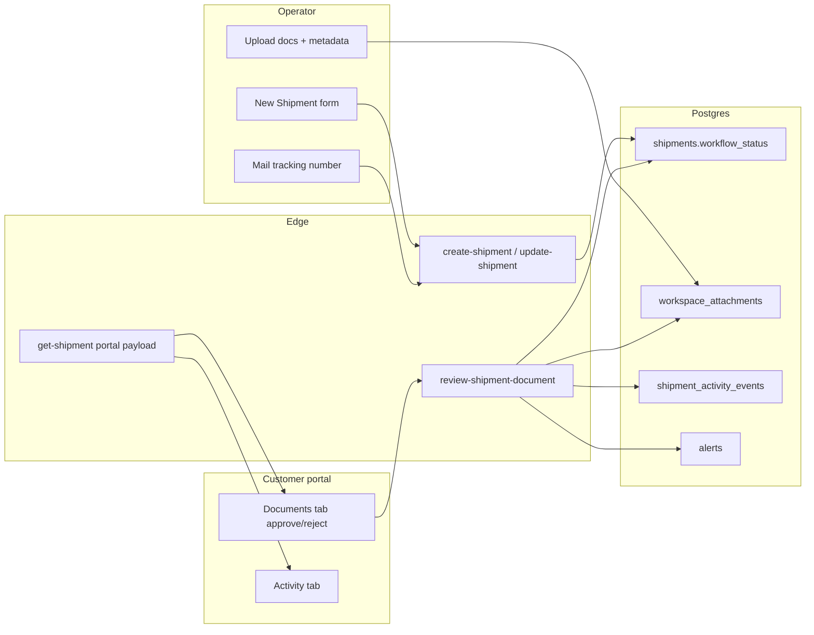
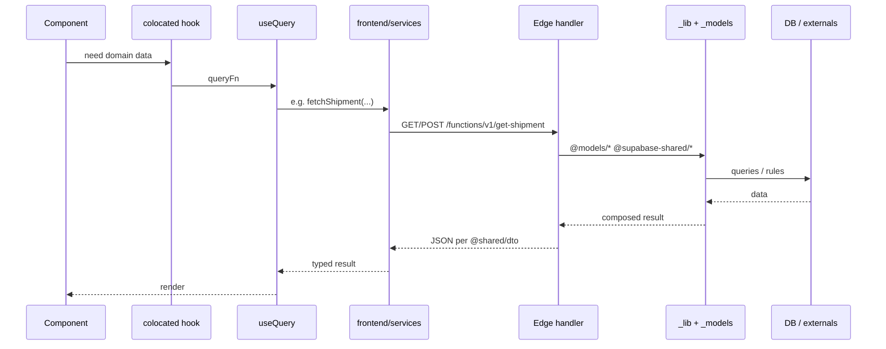
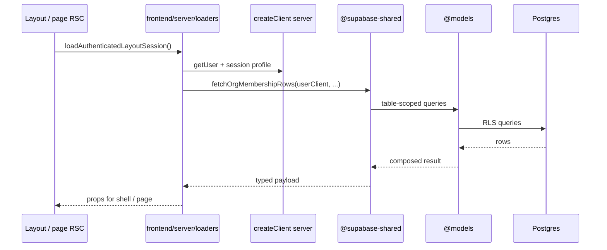

# Frontend ↔ backend communication and code organization

This document describes how the Containerly app moves data from UI to persistence, where each kind of code lives, and how **`@shared/dto`** defines contracts between **browser services**, **Edge handlers**, and **SSR loaders** against a single **`_lib` + `_models`** backend.

**Product note:** Primary user journeys are **export documentation**, **customer portal**, and **manual commercial data entry**. Live carrier container tracking (JSONCargo-style API, BOL bulk import) is an **optional premium path** enabled after document approval — not the default onboarding flow.

---

## 1. Executive summary — Supabase Edge backend ↔ frontend services

**Core pairing:**

```text
Supabase Edge (models + shared + slug services)  ↔  Frontend services  →  Component
```

- **Supabase backend (Edge bundle)** splits into three import surfaces (see `supabase/functions/deno.json`):
  - **`supabase/functions/_models/<table>.ts`** — **table-scoped persistence** only (PostgREST-style access helpers per table). Import **`@models/<table>.ts`** from Edge code and SSR loaders. No HTTP concerns.
  - **`supabase/functions/_lib/`** — **cross-cutting domain and infra** (portal payload builders, tracking orchestration, customer access, providers, `db`, `auth`, `logger`, `utils`). Import **`@supabase-shared/...`**.
  - **`supabase/functions/<slug>/handler.ts`** — **HTTP adapter** for that slug: CORS, auth, parse input, then call **`@supabase-shared/*`** and **`@models/*`** directly. Add a colocated extra module only when a slug has **large slug-only** logic; **do not** add files that only re-export shared symbols.
- **Frontend services** — **`frontend/services/*.service.ts`** are the only place the browser talks to that backend: **`fetch`** to `/functions/v1/<name>` with the user JWT (see `frontend/lib/supabase/edge-functions.ts` for shared transport). **TanStack Query** calls these service modules; components do not call Edge URLs directly.
- **Runtime flow:** **Component → colocated hook → TanStack Query → `frontend/services/` → HTTP → Edge `handler.ts` → `@models/*` / `@supabase-shared/*` → Postgres / externals.**

**SSR loaders (no HTTP):** RSC layouts and pages use **`frontend/server/loaders/*.ts`** (`import "server-only"`) to call the same **`@supabase-shared/*`** + **`@models/*`** code directly with the Next server Supabase client.

**Next HTTP (minimal):** Only **`/api/auth/session`** — syncs browser JWT into Next-readable cookies for RSC/middleware. **No** domain `/api` routes.

**Privileged operations:** Service role and superadmin gates run on **Edge** (`createServiceClient()` in handlers after auth checks), not on Next.

**Not for new data access:** `frontend/services/` calling **PostgREST** via `@/lib/supabase/client` (`.from` / `.rpc`) skips the Edge + models layer. Prefer adding or extending an Edge function whose slug service delegates to **`@models/*`** and **`@supabase-shared/*`**, plus a matching caller in `frontend/services/`. (Exceptions: **Auth** session/login, **Realtime** subscriptions, **Storage** uploads with `File` — keep using the Supabase client only for those transports until you add a dedicated pattern.)

**DTOs (`supabase/functions/_wire/dto/`, import `@shared/dto/`):** JSON request/response types shared by **`frontend/services/`**, **Edge handlers**, and **SSR loaders** so all runtimes stay aligned (plus envelopes like `ServiceResult<T>` in `common.dto.ts`).

### 1.0 The `supabase/functions/` directory — Edge HTTP API layer

Treat **`supabase/functions/`** as the **only domain HTTP API** for the app (browser calls via **`frontend/services/*.service.ts`**).

**Folder name = function slug = wire path.** Each immediate child folder is **one deployable Edge Function**. The **directory name must match the Supabase function slug** — that string is what the platform registers and what clients use in the URL:

`POST https://<project-ref>.supabase.co/functions/v1/<slug>`

The Supabase CLI deploys from **`supabase/functions/<slug>/`**; there is no separate “routing table” inside the repo. If you rename the folder, you must update **callers** (for example **`EDGE_FUNCTION_SLUGS`** in `frontend/lib/supabase/edge-function-slugs.ts`), any dashboards, cron jobs, or webhooks that target the old name.

**`index.ts` — entry only, request → handler handoff.** This file should stay minimal: **`Deno.serve`**, **CORS preflight** (`OPTIONS` → `corsHeaders`), then **forward the request** to the colocated handler, for example `return handle(req)`. It should not parse bodies, enforce auth, or contain business logic — that belongs in **`handler.ts`** so every HTTP concern for the slug lives in one obvious place next to the entry.

**`handler.ts` — colocated HTTP adapter for this slug.** The handler is the **per-endpoint wrapper**: HTTP method checks, read/parse JSON or query params, build the Supabase **user** or **service** client from the request, call domain code, map results and errors to **`Response`** (status + JSON). It answers: *“What does this specific HTTP call look like?”* — not *“How does tracking work end-to-end?”*

**Keep handlers thin; push work down the stack.** A handler should **not** grow into a monolith. Prefer:

1. **`@supabase-shared/*.ts`** — orchestration, provider calls, and workflows reused across slugs (or substantial slug-only logic kept out of the handler file when a colocated extra module is justified).
2. **`@models/<table>.ts`** — table-scoped persistence (`.from("<table>")` and related rules in one module per table).

Typical flow: **`handler.ts`** → **`@supabase-shared/...`** (domain service) → **`@models/...`** (and back). Shared modules import models; handlers compose shared + models only as much as needed for HTTP shaping.

**Reference implementation:** `supabase/functions/search-containers/` — **`index.ts`** delegates to **`handle`**; **`handler.ts`** validates method, parses the body, obtains `createUserClient(req)`, calls **`searchContainers`** from **`@supabase-shared/tracking-operations.service.ts`**, and returns **`jsonResponse`** with appropriate status codes. No heavy logic lives in the handler file itself.

```text
Client  →  /functions/v1/<slug>  →  index.ts (Deno.serve, CORS)  →  handler.ts (HTTP)  →  _lib/ (@supabase-shared)  →  _models/ (@models)
```

### 1.1 Repeatable pipeline (Supabase path)

Think in **four layers**, not two files:

| Layer | Location | Role |
|-------|----------|------|
| **Wire slug** | `supabase/functions/<slug>/index.ts` + `handler.ts` | **API layer** (see **§1.0**): **`index.ts`** → **`handler.ts`**; CORS, parse body/query, auth, call **`@supabase-shared/*`** / **`@models/*`**, return JSON. Slugs are **flat** (CLI rule); names are **verb-first** (`get-shipment`, `sync-container`, `create-customer-invite`, …). |
| **Use-case logic** | `supabase/functions/_lib/*.ts` (and **`_models/*.ts`**) | Composed by **`handler.ts`** and **SSR loaders**. Optional colocated file under **`functions/<slug>/`** only if logic is **substantial and slug-specific** — not for one-line re-exports. |
| **Table persistence** | `supabase/functions/_models/<table>.ts` | RLS-safe reads/writes for one Postgres table; **no** route-specific orchestration. |
| **Shared domain / infra** | `supabase/functions/_lib/*.ts` (+ `providers/...`) | Reused across multiple slugs (portal payload, tracking ops, providers, auth helpers). |
| **Contract** | `supabase/functions/_wire/dto/*.dto.ts` | Request/response shapes all runtimes import via `@shared/dto/`. |
| **Browser adapter** | `frontend/services/<domain>.service.ts` | `fetch` to `/functions/v1/<same-slug-as-folder>`; use **`EDGE_FUNCTION_SLUGS`** in `frontend/lib/supabase/edge-function-slugs.ts` so the path is never a magic string. |

**Why split `_models/` vs `_lib/` vs `handler.ts`?** Edge folders are **deployment units** (one slug each). Table access stays **stable and reusable** in **`supabase/functions/_models/`**. Workflows shared by several slugs live in **`supabase/functions/_lib/`**. Each slug’s **HTTP-specific** parsing, status mapping, and auth checks stay in **`handler.ts`** (or a colocated module only when that file would become unwieldy).

**Not strict 1:1 file-to-file:** One shared module (e.g. **`shipment-portal-payload.ts`**) can back **`get-shipment`** and **`preview-customer-shipment`** via different slug services. The **repeatable rule** is: **one Edge slug per HTTP entrypoint**, **one frontend service module per browser-facing domain**, **`shared/dto` per wire contract**, **models per table**, **shared per cross-slug workflow**.

### 1.2 Edge slugs ≠ table domains (granular persistence)

Deploy folder names (`get-shipment`, `create-tracking-request`, …) are **HTTP entrypoints**, not a full domain model. They do **not** map 1:1 to “domains in the database.”

For **separation of concerns at persistence**, treat **each table** (or an inseparable pair) as its own **table domain**. Product words map to tables like this:

| Product language | Primary table(s) |
|------------------|-------------------|
| Messages / thread | **`report_messages`** |
| Documents / files | **`workspace_attachments`** (+ Storage bucket `workspace-files`; optional `document_type`, `document_group`, `approval_status`) |
| Containers | **`containers`** |
| Shipments | **`shipments`**, **`shipment_lines`** (order/booking lines) |
| Tracking / sync jobs | **`tracking_requests`**, **`tracking_events`**, **`external_api_logs`** |
| Alerts | **`alerts`** (optional `shipment_id` for doc-only shipments) |
| Customer access | **`customer_invites`** (`delivery_mode`: email vs allowlist), **`shipment_customer_access`** |
| Shared report links | **`shared_reports`** |
| Activity feed | **`report_activity`**, **`shipment_activity_events`** (structured portal timeline) |
| Org / membership | **`organizations`**, **`organization_members`**, **`profiles`** |
| Collaboration | **`shipment_participants`**, **`shipment_notification_subscriptions`**, **`shipment_message_thread_reads`** |

**Convention:** **`supabase/functions/_models/<table>.ts`** holds **table-scoped reads/writes** for that Postgres table (exact identifier, e.g. `report_messages.ts`, `workspace_attachments.ts`, `shipment_lines.ts`, `shipment_activity_events.ts`). **Shared workflows** (`shipment-portal-payload.ts`, `shipment-portal-handlers.ts`, `shipment-operations.service.ts`, `document-workflow.service.ts`, `customer-access.service.ts`, `notification-workflow.service.ts`, `email.service.ts`, `tracking-operations.service.ts`, `workspace-operations.service.ts`, `tracking-bol-lookup.ts`, …) **import `@models/*`** and do not call `.from("<table>")` directly except inside the matching model file. Implemented model modules in-repo include: `alerts`, `containers`, `customer_invites`, `external_api_logs`, `organization_members`, `organizations`, `profiles`, `report_activity`, `report_messages`, `shared_reports`, `shipment_activity_events`, `shipment_customer_access`, `shipment_lines`, `shipment_participants`, `shipments`, `tracking_events`, `tracking_requests`, `workspace_attachments`.

**Orchestration:** A **use-case** (e.g. “shipment portal JSON”, “create tracking request + first sync”) **composes** several models. That orchestrator usually lives in **`supabase/functions/_lib/`** (reused across slugs and SSR loaders). It **must not** bury all table access in one giant model long-term—**call into `_models/`** so each table’s rules stay in one place.

**Frontend mirror:** **`frontend/services/`** exposes one browser adapter per product domain, each calling Edge slugs. PostgREST in `frontend/services/` is **not allowed** for domain data; new writes go through Edge + **`_models/`** / **`_lib/`** (§7).

**Registry — `public` tables in this repo (persistence domains):**

| Table | Purpose (short) |
|-------|-----------------|
| `profiles` | App profile row per `auth.users`; roles, display, account kind |
| `organizations` | Tenant |
| `organization_members` | User ↔ org membership + org role |
| `shipments` | Commercial shipment header; `workflow_status` for documentation lifecycle |
| `shipment_lines` | Order/booking line items (multi-line, multi-container) |
| `containers` | Physical container under a shipment |
| `tracking_requests` | Sync subscription / workflow row per container (or number) |
| `tracking_events` | Carrier/provider event history |
| `alerts` | In-app notifications; `container_id` and/or `shipment_id` |
| `external_api_logs` | Outbound API audit |
| `shared_reports` | Shareable report metadata for a shipment |
| `report_messages` | Thread messages (shipment and/or container scope) |
| `report_activity` | Legacy activity / audit stream |
| `shipment_activity_events` | Structured portal activity (docs approved, mail sent, thread messages, etc.); message rows link via **`report_message_id`** FK |
| `customer_invites` | Importer invite tokens; `delivery_mode` for email vs allowlist |
| `shipment_customer_access` | Grant linking customer user to shipment + visibility |
| `shipment_customer_access_requests` | Customer access request workflow (approve/deny) |
| `workspace_attachments` | File metadata; document workflow columns when customer-facing |
| `shipment_participants` | Org users participating on a shipment |
| `shipment_notification_subscriptions` | Per-user shipment notification preferences |
| `shipment_message_thread_reads` | Per-user read cursors for shipment threads |
| `platform_tenant_invites` | Superadmin-issued invites for new operator tenants |
| `user_feedback` | In-app feedback submissions |

**Auth:** `auth.users` is managed by Supabase Auth, not a custom service file; **`profiles`** is the table-aligned module for app-level user fields.

This registry should stay in sync when migrations add or rename tables.

### 1.3 Logistics documentation workflow (commercial shipments)

Shipments can exist **without container tracking**. Operators create a commercial header + **`shipment_lines`** via **`create-shipment`**; customers review documents and activity in the portal.



| Step | Edge slug | `_lib` module | DTO |
|------|-----------|---------------|-----|
| Create / update commercial shipment | `create-shipment`, `update-shipment` | `shipment-operations.service.ts` | `@shared/dto/logistics.dto.ts`, `shipment.dto.ts` |
| Customer document approve/reject | `review-shipment-document` | `document-workflow.service.ts` | `logistics.dto.ts` |
| Portal read (docs, activity, commercial) | `get-shipment` | `shipment-portal-payload.ts`, `shipment-portal-handlers.ts` | `shipment.dto.ts` |
| Notion-style allowlist claim | `claim-shipment-access` | `customer-access.service.ts` | `customer-access.dto.ts` |
| Transactional email + in-app alerts | (called from `_lib` services) | `email.service.ts`, `notification-workflow.service.ts` | — |
| List / acknowledge alerts | `list-alerts`, `acknowledge-alert`, `acknowledge-all-alerts` | `alert-operations.service.ts` | `alert.dto.ts` |
| Operator shipment list | `list-operator-shipments` | `shipment-list-operations.service.ts` | — |
| Tracking dashboard snapshot | `get-tracking-dashboard` | `tracking-dashboard-operations.service.ts` | — |

**`workflow_status` on `shipments`:** `draft` → `awaiting_review` → `revisions_needed` | `approved` → `mailed` → `in_transit` (when carrier tracking is linked).

**Frontend entry points:** header **New Shipment** (`NewShipmentForm` + optional tracking tab), operator workspace `/shipments/[shipmentId]`, customer portal `/requests/[reportId]` (`PublicContainerReport`).

---

## 2. End-to-end dependency flow

Preferred direction of dependencies (no cycles): **`_models/`** and **`_lib/`** are the single backend; **Edge `handler.ts`** is the browser HTTP adapter; **`frontend/server/loaders/`** is the SSR adapter (same `_lib`, no HTTP); **`frontend/services/`** is the browser SDK; **UI** sits above.

```mermaid
flowchart LR
  subgraph ui [UI layer]
    C[Route components / shared components]
    H[Colocated hooks useComponent]
    RSC[RSC layouts / pages]
  end
  subgraph browser [Browser path]
    Q[TanStack Query hooks]
    FSvc[frontend/services/*.service.ts]
  end
  subgraph ssr [SSR path]
    L[frontend/server/loaders/*.ts]
  end
  subgraph backend [Single backend code]
    Edge[Edge handler.ts]
    Lib[_lib @supabase-shared]
    Models[_models @models]
  end
  subgraph authOnly [Next auth only]
    AuthRoute[/api/auth/session]
  end
  subgraph persistence [Persistence]
    DB[(Postgres / Supabase)]
  end
  subgraph contracts [Wire contract]
    DTO[_wire/dto @shared/dto]
  end

  C --> H
  H --> Q
  Q --> FSvc
  FSvc -->|functions/v1| Edge
  FSvc --> AuthRoute
  RSC --> L
  L --> Lib
  Edge --> Lib
  Lib --> Models
  Models --> DB
  DTO -.-> FSvc
  DTO -.-> Edge
  DTO -.-> L
```

---

## 3. Request flowcharts — browser, SSR, and auth

### 3.1 Browser path — `frontend/services` ↔ Edge ↔ `_lib` + `_models`



**Example:** `ShipmentPortalPayload` (`@shared/dto/shipment.dto.ts`) — built from **`@supabase-shared/shipment-portal-handlers.ts`** (and **`shipment-portal-payload.ts`**) plus **`@models/*`**, invoked from **`supabase/functions/get-shipment/handler.ts`**, HTTP slug `get-shipment`, caller `frontend/services/shipment.service.ts` (`EDGE_FUNCTION_SLUGS.shipments.get`).

**Supabase CLI:** Edge deploy still uses **`supabase/functions/<name>/`** (required by the CLI). **`handler.ts` / `index.ts`** stay thin; use-case code lives in **`_lib/`**, table access in **`_models/`**.

**Privileged operations** (service role, superadmin gates, multipart uploads) use the **same browser path**: the Edge handler calls `createServiceClient()` after `requireAuthUserId` and role checks — not Next `/api`.

### 3.2 SSR path — RSC loaders call `_lib` directly (no HTTP)



**Example:** `frontend/server/loaders/authenticated-layout.ts` imports `fetchOrgMembershipRows` from `@supabase-shared/organization-operations.service` and `getSessionProfile` from `frontend/services/auth-server.service.ts` (SSR session helper only).

**Loaders in-repo:** `authenticated-layout.ts`, `profile-settings.ts`, `admin.ts`.

### 3.3 Auth cookie bridge — `/api/auth/session` only

The browser writes the Supabase JWT into Next-readable cookies so RSC and middleware can read the session. This is the **only** domain-adjacent Next route.

```text
auth.service.ts  →  POST /api/auth/session  →  supabase.auth.setSession  →  cookie store
```

---

## 4. Folder and file roles

| Location | Role |
|----------|------|
| `frontend/app/(routes)/...` | App Router pages; route-specific UI colocated under the route |
| `frontend/components/` | Reusable, route-agnostic UI only |
| `frontend/app/api/auth/session/route.ts` | **Only** Next route: sync browser JWT into cookies for RSC/middleware |
| `frontend/server/loaders/*.ts` | **SSR loaders** (`server-only`): session glue + call **`@supabase-shared/*`** / **`@models/*`** directly — no HTTP |
| `frontend/services/*.service.ts` | **Browser SDK:** `edgeFunctionFetch` to `/functions/v1/<slug>`; **no** PostgREST `.from` / `.rpc` for domain data |
| `frontend/services/auth-server.service.ts` | SSR-only session profile helper (not a domain backend) |
| `supabase/functions/_models/<table>.ts` | **Table persistence** — one module per Postgres table; import **`@models/<table>.ts`** |
| `supabase/functions/_lib/` | **Cross-slug domain + infra** — portal builders, tracking ops, workspace ops, providers, `db`, `auth`, `logger`; import **`@supabase-shared/...`** |
| `supabase/functions/<slug>/handler.ts` + `index.ts` | **Deployable Edge HTTP API** (see **§1.0**): slug = folder name = `/functions/v1/<slug>`; **`index.ts`** hands off to **`handler.ts`**; handler stays thin and delegates to **`@supabase-shared/*`** / **`@models/*`** |
| `frontend/hooks/queries/`, `frontend/hooks/mutations/` | TanStack Query; call `frontend/services` only |
| `frontend/lib/supabase/` | Supabase client factories (browser, server) + `edgeFunctionFetch` / `EDGE_FUNCTION_SLUGS` |
| `frontend/types/` | App-specific and DB-aligned types (e.g. generated or hand-maintained table shapes) |
| `supabase/functions/_wire/dto/` | HTTP contract (`@shared/dto/`) shared by **frontend services**, **Edge handlers**, and **SSR loaders** |

### 4.1 Component folder convention (route or shared)

Colocated pure helpers live in a **single** `utils.ts` next to the component — not a `utils/` directory.

```
ComponentName/
  index.tsx              # presentation
  useComponentName.ts    # optional orchestration; uses Query hooks
  constants.ts           # optional — labels, class strings, static config
  utils.ts               # optional — pure helpers only (one file)
  types.ts               # optional
```

Shared across routes: `frontend/utils/` (or domain-specific files under `frontend/utils/`).

---

## 5. DTO strategy (`supabase/functions/_wire/dto/`)

### 5.1 Purpose

- **Single source of truth** for JSON bodies and query semantics between:
  - **Frontend services:** `frontend/services/*.ts`
  - **Supabase Edge:** `supabase/functions/<slug>/handler.ts` (Deno)
  - **SSR loaders:** `frontend/server/loaders/*.ts` (when returning typed shapes)
- Avoid duplicating large portal or tracking shapes in two places.
- `supabase/functions/_wire/dto/index.ts` re-exports modules; import as `@shared/dto/...` from Edge and frontend.

### 5.2 What belongs in `shared/dto`

- Request/response types for **Edge Function** APIs (`CreateTrackingRequestBody`, `CreateShipmentBody`, `ShipmentPortalPayload`, `ReviewShipmentDocumentBody`, `AcceptCustomerInviteResponse`, etc.).
- Small **cross-cutting** helpers such as `ServiceResult<T>` / `ErrorResponse` in `shared/dto/common.dto.ts` for consistent success/error envelopes.

### 5.3 What usually does *not* belong there

- React props or view models.
- Types that only describe PostgREST rows — prefer `frontend/types/database.ts` (or generated types) unless an Edge function intentionally mirrors a table 1:1 in its public API.
- Next.js Route Handler–only payloads (auth session is the only route; no domain DTOs on Next).

### 5.4 Example (trimmed)

**DTO** (`@shared/dto/shipment.dto.ts`):

```ts
export type ShipmentPortalPayload = {
  report: ReportMeta;
  organization: ReportOrganization;
  summary: ReportSummary;
  // ...
};
```

**Frontend service** consumes it after `JSON.parse`:

```ts
import type { ShipmentPortalPayload } from "@shared/dto/shipment.dto";

// parse response, then:
return { ok: true, data: body as ShipmentPortalPayload };
```

**Slug services and shared modules** import the same DTO types when building the response so the compiler checks field names and nesting.

---

## 6. Mental model: NestJS mapping

| NestJS | This repo |
|--------|-----------|
| **UI** | Components + colocated hooks |
| **Client cache** | TanStack Query (`frontend/hooks/`) |
| **HTTP client SDK** | `frontend/services/*.service.ts` |
| **Controller (browser)** | `supabase/functions/<slug>/handler.ts` |
| **Controller (SSR)** | `frontend/server/loaders/*.ts` (no HTTP) |
| **Service** | `supabase/functions/_lib/*.ts` (`@supabase-shared/`) |
| **Repository** | `supabase/functions/_models/<table>.ts` (`@models/`) |
| **DTOs** | `supabase/functions/_wire/dto/` (`@shared/dto/`) |
| **Auth cookie bridge** | `app/api/auth/session/route.ts` only |

`@shared/dto/` keeps **frontend services**, **Edge handlers**, and **SSR loaders** aligned on typed shapes.

---

## 7. Copy-paste checklist for new features

1. **UI** in route folder or `frontend/components/`; no `fetch`, no Supabase in `index.tsx`.
2. **Colocated hook** if orchestration or local UI state is non-trivial.
3. **TanStack Query** hook in `frontend/hooks/queries/` or `mutations/`.
4. **Backend logic:** add or extend **`supabase/functions/_models/<table>.ts`** for table access and **`supabase/functions/_lib/`** for cross-slug use-cases; add **`supabase/functions/_wire/dto/`** for the wire contract.
5. **Edge slug:** thin **`supabase/functions/<slug>/handler.ts`** (+ **`index.ts`**) — auth, parse input, call **`@models/*`** / **`@supabase-shared/*`**, return JSON. Register slug in **`EDGE_FUNCTION_SLUGS`** and **`supabase/config.toml`**.
6. **Frontend service:** add a caller in **`frontend/services/<area>.service.ts`** using **`edgeFunctionFetch`** + **`EDGE_FUNCTION_SLUGS`**. Query hooks call **only** `frontend/services/`.
7. **Privileged ops:** use **`createServiceClient()`** inside the Edge handler after `requireAuthUserId` + role checks — **not** Next `/api`.
8. **SSR reads:** add **`frontend/server/loaders/<page>.ts`** that calls the same **`@supabase-shared/*`** modules with Next `createClient()` — no HTTP round-trip.
9. **Avoid** PostgREST (`.from` / `.rpc`) inside `frontend/services/` for domain data.
10. **Parent–child deletes:** use **`ON DELETE CASCADE`** in migrations for owned rows (see **§9**); delete handlers remove **one** parent row and let Postgres cascade.

---

## 8. Auth, sign-up, and operator onboarding

Operator authentication and tenant provisioning use **Supabase Auth** (browser), **Edge functions** (org creation, invites, onboarding status), **`/api/auth/session`** (cookie bridge), and **marketing-route wizards**.

### Routes

| Route | Role |
|-------|------|
| `/login` | Sign-in only (email/password). Link to `/signup`. |
| `/signup` | 3-step wizard: account → organization → optional team invites. Query `?step=2` / `?step=3`. |
| `/set-password` | Invite/recovery password; redirects to `/signup?step=2` when the user has no org. |
| `/dashboard?welcome=1` | Post-sign-up landing; `WelcomeModalHost` in `AuthenticatedAppShell`. |

### Data flow (sign-up)

```text
/signup step 1  →  auth.service signUpWithEmail / OAuth  →  Supabase Auth
                  →  auth.service syncSessionCookies  →  POST /api/auth/session
/signup step 2  →  onboarding.service  →  Edge complete-onboarding-organization
                    →  @supabase-shared/onboarding-operations.service
/signup step 3  →  organization.service (loop)  →  Edge invite-organization-member
```

**Self-serve org creation:** `complete-onboarding-organization` creates an org when the user has no membership, with or without a pending `platform_tenant_invites` row (tenant invites still mark the invite accepted when present).

**Onboarding profile columns** on `organizations`: `team_size`, `monthly_shipment_volume` (collected in step 2).

**Gating:** `OnboardingGate` (authenticated shell) redirects users without org membership to `/signup?step=2` (superadmins exempt).

### OAuth (dev/staging)

`LoginOAuthButtons` renders Google (first) and Microsoft below the email form with brand icons. Visibility is controlled by `frontend/lib/oauth-buttons.ts` (`NODE_ENV !== "production"`) — same pattern as `frontend/lib/pricing-page.ts`.

### Key frontend modules

| Area | Location |
|------|----------|
| Sign-up wizard | `app/(marketing)/signup/components/` |
| OAuth buttons | `app/(marketing)/login/components/LoginOAuthButtons/` |
| Welcome modal | `components/WelcomeModal/`, `contexts/welcome-modal.tsx` |
| Onboarding gate | `app/(authenticated)/components/OnboardingGate/` |
| Browser onboarding API | `services/onboarding.service.ts` → Edge `get-onboarding-status`, `complete-onboarding-organization` |
| Org invites | `services/organization.service.ts` → Edge `invite-organization-member` |

Team invites after sign-up reuse the same Edge `invite-organization-member` contract as **Settings → Organization → Invite Teammate**.

---

## 9. Referential integrity and cascade deletes

Parent–child **ownership** is enforced in **Postgres**, not in application code. When a parent row is deleted, owned children are removed by **`ON DELETE CASCADE`** foreign keys. Do not add sequential multi-table deletes in Edge handlers, `_lib` services, or TanStack mutations to compensate for missing cascades — add or fix a migration instead.

**Migration:** `supabase/migrations/20260611130000_cascade_delete_and_storage_cleanup.sql`

### 9.1 Ownership hierarchy (CASCADE)

```text
organizations
  └── organization_members, shipments, … (denormalized organization_id on most children)
shipments
  └── containers, shipment_lines, shipment_participants, report_messages,
      workspace_attachments, alerts (shipment_id), customer access/invites,
      shipment_activity_events, subscriptions, thread reads, …
containers
  └── container-scoped report_messages, workspace_attachments,
      tracking_requests, tracking_events, alerts (container_id)
report_messages
  └── parent_message_id replies, workspace_attachments.report_message_id,
      alerts.report_message_id, shipment_activity_events.report_message_id
```

**Application delete paths stay single-table.** Examples: `deleteShipmentInOrganization` (`@models/shipments.ts` via `shipment-operations.service.ts`), `deleteReportMessageByIdForUser`, `removeWorkspaceAttachmentByIdForUser` — each deletes one row; Postgres cascades the rest.

### 9.2 FK fixes in `20260611130000`

| Child | Parent column | Policy | Rationale |
|-------|---------------|--------|-----------|
| `tracking_events` | `container_id` | **CASCADE** | Events are owned by container; prior `SET NULL` on a NOT NULL column blocked shipment delete |
| `tracking_requests` | `container_id` | **CASCADE** | Sync row has no meaning without its container |
| `alerts` | `container_id` | **CASCADE** | Container-scoped triage alerts should not outlive the container |
| `shipment_activity_events` | `report_message_id` | **CASCADE** (new FK) | Replaces JSON-only `metadata.message_id` link; timeline rows die with the thread message |
| `tracking_requests` | `created_by` | **SET NULL** | Audit attribution, not ownership — user delete must not wipe sync rows |
| `shared_reports` | `created_by` | **SET NULL** | Same — share links survive creator removal |

New message activity inserts set **`report_message_id`** in `@supabase-shared/workspace-operations.service.ts` and `@supabase-shared/message-activity.service.ts`. Edit sync queries by FK, not JSON.

### 9.3 Intentionally not CASCADE

| Pattern | Examples | Policy |
|---------|----------|--------|
| User attribution | `actor_user_id`, `author_user_id`, `assignee_user_id`, `acknowledged_by`, `reviewed_by_user_id` | **SET NULL** |
| User delete guard | `workspace_attachments.uploaded_by` | **RESTRICT** — reassign or delete files before removing the uploader |
| Telemetry / retention | `external_api_logs.organization_id`, `user_feedback.organization_id`, `platform_tenant_invites.organization_id` | **SET NULL** |
| Audit survivability | `report_activity` optional FKs, access-request link columns | **SET NULL** |
| Commercial unlink | `shipment_lines.container_id` | **SET NULL** — line may outlive container association |
| Soft revoke | `shipment_customer_access.revoked_at`, `shared_reports.revoked_at`, invite `status` | Row kept; RLS/RPC filters, not FK delete |

Optional context FKs such as `alerts.tracking_request_id` remain **SET NULL** (alert history may survive sync-row removal).

### 9.4 Storage cleanup (DB triggers)

Storage buckets are not FK-linked to `public` tables. **`SECURITY DEFINER`** triggers remove matching **`storage.objects`** rows when parent DB rows are deleted (with `storage.allow_delete_query` for Supabase’s protect-delete guard):

| Trigger | Table | Bucket | Path source |
|---------|-------|--------|-------------|
| `workspace_attachments_storage_cleanup_trigger` | `workspace_attachments` | `workspace-files` | `storage_path` |
| `profiles_storage_cleanup_trigger` | `profiles` | `profile-images` | `profile_image_path` |
| `organizations_storage_cleanup_trigger` | `organizations` | `org-images` | `org_image_path` |

Cascade deletes of many attachments (e.g. shipment delete) fire one trigger per row — no app-side storage loop. Direct attachment delete also relies on the trigger (no duplicate `storage.remove` in `_lib` services).

**Limitation:** SQL deletes update `storage.objects` metadata. On hosted Supabase with S3, physical blob removal is normally handled by the Storage API; if orphaned blobs appear in production, add an Edge + `pg_net` follow-up — do not reintroduce manual cleanup in UI services for the happy path.

**Orphans without DB rows:** failed uploads may leave storage objects with no `workspace_attachments` row — not FK-related; consider a separate sweep job.

### 9.5 Adding new parent–child tables

1. Define the FK in a forward-only migration with explicit **`ON DELETE CASCADE`** when the child is **owned** by the parent.
2. Use **`SET NULL`** only for optional audit/context columns; **`RESTRICT`** when deletion must be blocked until dependents are handled.
3. If the child stores a Storage path, add a matching cleanup trigger (same `allow_delete_query` pattern).
4. Keep delete handlers **single-table**; verify with `supabase db reset` and a local delete smoke test.

---

## 10. Related in-repo references

- Architecture rules for day-to-day edits: `.cursorrules`
- Cascade delete migration: `supabase/migrations/20260611130000_cascade_delete_and_storage_cleanup.sql`
- SSR loaders: `frontend/server/loaders/`
- Edge slug registry: `frontend/lib/supabase/edge-function-slugs.ts`
- Example imports: `grep -r "@models/" supabase/functions`, `grep -r "@supabase-shared/" supabase/functions frontend/server`, and `grep -r "@shared/dto" supabase/functions frontend`

---

*Last aligned with single-backend migration (Edge + SSR loaders; `/api/auth/session` only) and cascade-delete enforcement (`20260611130000`). Update when adding Edge slugs, loaders, or FK delete policy.*
